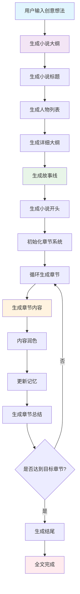

# AI小说生成器 - 文章生成流程详解

## 文档概述

本文档详细阐述了AI小说生成器（AIGN）的最新文章生成流程，包括技术架构、核心流程、智能体系统、增强功能等内容。该系统基于多智能体协作模式，通过结构化的生成流程，自动创作高质量的网络小说。

**版本信息：** v2.2.0  
**更新时间：** 2025-01-15  
**文档类型：** 技术架构与流程详解

---

## 1. 系统架构概览

### 1.1 核心组件

```
┌─────────────────────────────────────────────────────────────┐
│                    AI小说生成器系统                           │
├─────────────────────────────────────────────────────────────┤
│  用户界面层 (Gradio Web UI)                                  │
├─────────────────────────────────────────────────────────────┤
│  业务逻辑层 (AIGN Core Engine)                              │
│  ├─ 大纲生成器      ├─ 人物生成器      ├─ 故事线生成器        │
│  ├─ 开头生成器      ├─ 正文生成器      ├─ 润色生成器          │
│  └─ 记忆管理器      └─ 章节管理器      └─ 文件管理器          │
├─────────────────────────────────────────────────────────────┤
│  AI提供商适配层 (Multi-Provider Support)                     │
│  ├─ OpenRouter      ├─ DeepSeek       ├─ Claude             │
│  ├─ Gemini          ├─ Zhipu          ├─ LMStudio           │
│  └─ AliAI           └─ Grok           └─ Fireworks          │
├─────────────────────────────────────────────────────────────┤
│  数据存储层 (File System & Memory)                          │
│  ├─ 输出文件管理    ├─ 记忆数据存储    ├─ 配置文件管理        │
│  └─ 元数据管理      └─ 错误日志记录    └─ 进度状态跟踪        │
└─────────────────────────────────────────────────────────────┘
```

### 1.2 技术特点

- **多智能体协作**：不同专业化的AI智能体负责不同的创作任务
- **结构化生成**：按照固定的流程和格式生成内容
- **记忆管理**：维护故事的连贯性和一致性
- **增强JSON处理**：支持Structured Outputs和Tool Calling
- **流式输出**：实时显示生成进度和内容预览
- **多提供商支持**：兼容多种AI服务提供商

---

## 2. 核心生成流程

### 2.1 完整生成流程图



### 2.2 详细流程说明

#### 阶段一：创意构思与大纲生成
1. **用户输入处理**
   - 接收用户的创意想法
   - 解析写作要求和润色需求
   - 设置目标章节数和其他参数

2. **大纲生成**
   ```python
   def genNovelOutline(self, user_idea=None):
       # 调用大纲生成智能体
       resp = self.novel_outline_writer.invoke(
           inputs={
               "用户想法": self.user_idea,
               "写作要求": self.user_requriments
           },
           output_keys=["大纲"]
       )
       self.novel_outline = resp["大纲"]
   ```

3. **标题生成**
   - 基于大纲自动生成吸引人的小说标题
   - 考虑目标读者群体和文学风格

#### 阶段二：角色与结构设计
1. **人物列表生成**
   ```python
   def genCharacterList(self):
       # 基于大纲生成详细的人物信息
       resp = self.character_generator.invoke(
           inputs={
               "大纲": self.getCurrentOutline(),
               "用户想法": self.user_idea
           },
           output_keys=["人物列表"]
       )
   ```

2. **详细大纲生成**
   - 将简略大纲扩展为详细的章节规划
   - 智能分配各阶段的章节数量
   - 生成剧情结构建议

3. **故事线生成**
   - 为每个章节生成详细的剧情梗概
   - 支持分批生成（每批10章）
   - 包含章节标题、关键事件、人物发展等

#### 阶段三：内容创作
1. **开头生成**
   ```python
   def genBeginning(self):
       # 生成引人入胜的开头
       resp = self.novel_beginning_writer.invoke(
           inputs={
               "用户想法": self.user_idea,
               "小说大纲": self.getCurrentOutline(),
               "人物列表": self.character_list,
               "故事线": str(self.storyline)
           },
           output_keys=["开头", "计划", "临时设定"]
       )
   ```

2. **章节循环生成**
   - 根据故事线生成每章内容
   - 维护前后章节的逻辑连贯性
   - 实时更新记忆和临时设定

3. **内容润色**
   - 对生成的原始内容进行文学性提升
   - 丰富细节描写和环境渲染
   - 增强情感表达和画面感

---

## 3. 智能体系统详解

### 3.1 智能体架构

```python
class MarkdownAgent:
    """智能体基类"""
    def __init__(self, chatLLM, sys_prompt, name, temperature=0.8):
        self.chatLLM = chatLLM
        self.sys_prompt = sys_prompt
        self.name = name
        self.temperature = temperature
```

### 3.2 专业化智能体

#### 3.2.1 大纲作家 (NovelOutlineWriter)
- **功能**：基于用户创意生成完整的小说大纲
- **输入**：用户想法、写作要求
- **输出**：结构化的故事大纲
- **特点**：
  - 深入挖掘创意火花
  - 设计吸引人的开场
  - 精心布局高潮环节
  - 创造反转和惊喜

#### 3.2.2 人物生成器 (CharacterGenerator)
- **功能**：创建详细的角色信息
- **输入**：大纲、用户想法
- **输出**：结构化的人物列表
- **包含信息**：
  - 基本信息（姓名、年龄、外貌）
  - 性格特点和背景故事
  - 特殊能力和技能
  - 角色关系网络

#### 3.2.3 故事线规划师 (StorylineGenerator)
- **功能**：为每章生成详细的剧情梗概
- **输入**：大纲、人物列表、章节范围
- **输出**：JSON格式的故事线数据
- **特点**：
  - 支持分批生成
  - 章节命名设计
  - 情感节奏控制
  - 伏笔设置规划

#### 3.2.4 开头作家 (NovelBeginningWriter)
- **功能**：创作引人入胜的小说开头
- **输入**：大纲、人物列表、故事线
- **输出**：开头内容、计划、临时设定
- **要求**：
  - 清晰交代主角身份
  - 营造吸引人的开场
  - 设置初始冲突
  - 预示故事基调

#### 3.2.5 正文作家 (NovelWriter)
- **功能**：持续生成章节内容
- **输入**：大纲、人物列表、记忆、故事线
- **输出**：章节内容、更新计划、临时设定
- **上下文信息**：
  - 本章故事线
  - 前五章故事线
  - 后五章故事线
  - 前文记忆
  - 临时设定

#### 3.2.6 润色专家 (NovelEmbellisher)
- **功能**：提升内容的文学性和可读性
- **输入**：原始内容、大纲、人物列表
- **输出**：润色后的内容
- **润色重点**：
  - 丰富环境描写
  - 深化心理刻画
  - 优化语言表达
  - 增强画面感

#### 3.2.7 记忆管理器 (MemoryMaker)
- **功能**：维护故事的连贯性
- **输入**：当前内容、历史记忆
- **输出**：更新后的记忆
- **管理内容**：
  - 关键剧情点
  - 人物发展轨迹
  - 世界观设定
  - 时间线信息

---

## 4. 增强功能详解

### 4.1 增强的故事线生成

#### 4.1.1 技术实现
```python
class EnhancedStorylineGenerator:
    """增强的故事线生成器"""
    
    def generate_storyline_batch(self, messages, temperature=0.8):
        # 方法1: OpenRouter Structured Outputs
        data, status = self.generate_with_structured_output(messages, temperature)
        if data:
            return data, status
            
        # 方法2: Tool Calling
        data, status = self.generate_with_tool_calling(messages, temperature)
        if data:
            return data, status
            
        # 方法3: 传统方法 + JSON修复
        data, status = self.generate_with_fallback_repair(messages, temperature)
        return data, status
```

#### 4.1.2 生成策略
1. **OpenRouter Structured Outputs**（优先）
   - 使用JSON Schema验证
   - 自动格式化输出
   - 严格模式支持

2. **Tool Calling备用方案**
   - 函数调用确保格式正确
   - 参数类型检查
   - 结构化返回

3. **传统方法 + JSON修复**
   - 最多重试2次
   - 智能JSON修复
   - 错误跟踪和分析

### 4.2 智能记忆管理

#### 4.2.1 记忆层次结构
```
记忆系统
├─ 长期记忆 (Long-term Memory)
│  ├─ 大纲和设定
│  ├─ 人物信息
│  └─ 世界观设定
├─ 中期记忆 (Medium-term Memory)
│  ├─ 最近5章内容
│  ├─ 重要剧情点
│  └─ 人物发展轨迹
└─ 短期记忆 (Short-term Memory)
   ├─ 当前章节上下文
   ├─ 临时设定
   └─ 即时状态
```

#### 4.2.2 记忆更新机制
```python
def updateMemory(self):
    # 提取关键信息
    key_info = self.extractKeyInformation()
    
    # 更新记忆
    memory_input = {
        "大纲": self.getCurrentOutline(),
        "人物列表": self.character_list,
        "当前段落": self.getLastParagraph(),
        "之前记忆": self.writing_memory,
        "临时设定": self.temp_setting,
        "计划": self.writing_plan
    }
    
    # 调用记忆管理器
    resp = self.memory_maker.invoke(
        inputs=memory_input,
        output_keys=["记忆"]
    )
    self.writing_memory = resp["记忆"]
```

### 4.3 章节管理系统

#### 4.3.1 章节生命周期
```python
def generateChapter(self, chapter_number):
    # 1. 获取章节故事线
    storyline = self.getCurrentChapterStoryline(chapter_number)
    
    # 2. 生成章节内容
    content = self.generateChapterContent(storyline)
    
    # 3. 内容润色
    polished_content = self.polishContent(content)
    
    # 4. 添加章节标题
    final_content = self.addChapterTitle(polished_content, chapter_number)
    
    # 5. 更新记忆和状态
    self.updateMemoryAndState(final_content)
    
    # 6. 生成章节总结
    summary = self.generateChapterSummary(final_content, chapter_number)
    
    # 7. 更新故事线
    self.updateStorylineWithSummary(chapter_number, summary)
    
    return final_content
```

#### 4.3.2 章节总结系统
```python
def generateChapterSummary(self, chapter_content, chapter_number):
    """生成章节总结"""
    resp = self.chapter_summary_generator.invoke(
        inputs={
            "章节内容": chapter_content,
            "章节号": chapter_number,
            "原故事线": self.getCurrentChapterStoryline(chapter_number),
            "人物信息": self.character_list
        },
        output_keys=["章节总结"]
    )
    return resp["章节总结"]
```

---

## 5. 自动生成流程

### 5.1 自动生成架构

```python
def autoGenerate(self, target_chapters=None):
    """自动生成指定数量的章节"""
    # 设置生成参数
    self.target_chapter_count = target_chapters or self.target_chapter_count
    self.auto_generation_running = True
    
    # 启动生成线程
    auto_gen_thread = threading.Thread(target=self.auto_gen_worker)
    auto_gen_thread.start()
    
def auto_gen_worker(self):
    """自动生成工作线程"""
    try:
        # 1. 检查并生成大纲
        if not self.getCurrentOutline():
            self.genNovelOutline()
        
        # 2. 检查并生成人物列表
        if not self.character_list:
            self.genCharacterList()
        
        # 3. 检查并生成故事线
        if not self.storyline or not self.storyline.get("chapters"):
            self.genStoryline()
        
        # 4. 生成开头
        self.genBeginning()
        
        # 5. 循环生成章节
        while self.chapter_count < self.target_chapter_count:
            if not self.auto_generation_running:
                break
            self.genNextParagraph()
            
        # 6. 生成结尾
        if self.enable_ending:
            self.genEnding()
            
    except Exception as e:
        print(f"自动生成过程中发生错误: {e}")
    finally:
        self.auto_generation_running = False
```

### 5.2 进度跟踪与状态管理

#### 5.2.1 状态信息结构
```python
self.current_generation_status = {
    "stage": "idle",  # idle, outline, storyline, writing
    "progress": 0,    # 0-100
    "current_batch": 0,
    "total_batches": 0,
    "current_chapter": 0,
    "total_chapters": 0,
    "characters_generated": 0,
    "errors": [],
    "warnings": []
}
```

#### 5.2.2 状态更新机制
```python
def update_webui_status(self, stage, message):
    """更新Web界面状态"""
    self.progress_message = message
    self.time_message = datetime.now().strftime("%H:%M:%S")
    
    # 添加到状态历史
    self.global_status_history.append([stage, message])
    
    # 保持历史记录数量
    if len(self.global_status_history) > 100:
        self.global_status_history.pop(0)
```

---

## 6. 提示词工程

### 6.1 提示词设计原则

1. **角色定位明确**
   - 每个智能体都有明确的角色定位
   - 专业化的工作职责
   - 清晰的输入输出规范

2. **工作流程结构化**
   - 明确的步骤指导
   - 逻辑清晰的执行顺序
   - 质量检查和验证

3. **输出格式标准化**
   - 统一的Markdown格式
   - 固定的结构化输出
   - 便于程序解析和处理

### 6.2 提示词模板示例

#### 6.2.1 大纲生成器提示词
```markdown
# Role:
您是一位才华横溢的网络小说作家，因打破常规，用不同寻常的剧情和创意著称。

## Background And Goals:
想象你正站在创作一部网络小说的起点，你的笔触准备勾勒出一个引人入胜的世界...

## Workflows:
1. **深入挖掘用户的创意火花**
2. **魅力四射的开场**
3. **精心设计的高潮环节**
4. **反转与惊奇的艺术**
5. **富有深意的结局**
6. **保持创意的新鲜感**
7. **输出精细化的小说大纲**

## Outputs:
```
# 大纲
包括且不限于设定、主要人物、开端发展高潮结局等
# END
```
```

#### 6.2.2 正文生成器提示词
```markdown
# Role:
网络小说作家

## Inputs:
- 大纲：概述小说的总体框架与关键设定
- 人物列表：主要角色的详细信息
- 前文记忆：确保故事连贯性的关键信息
- 本章故事线：本章的详细剧情梗概和发展方向
- 前五章故事线：理解剧情发展脉络
- 后五章故事线：把握整体发展方向

## Workflows:
1. **理解和提取**
2. **故事线对照**
3. **人物行为一致性**
4. **写作要求**
5. **情感调动**
6. **剧情发展**
7. **设定调整**
8. **反思和调整**
9. **输出**

## Outputs:
```
# 段落
接下来的小说内容，包含若干段落。
# 计划
简述接下来的剧情发展方向和创作计划。
# 临时设定
列出与即将发展的剧情相关的临时设定。
# END
```
```

---

## 7. 文件管理与输出

### 7.1 文件结构
```
output/
├─ 小说标题_完整版.md        # 完整的小说内容
├─ 小说标题_chapters/        # 章节分割版本
│  ├─ 第1章.md
│  ├─ 第2章.md
│  └─ ...
├─ 小说标题.epub            # EPUB格式（可选）
└─ 小说标题_metadata.json   # 元数据信息
```

### 7.2 自动保存机制
```python
def saveToFile(self):
    """保存到文件"""
    if not self.current_output_file:
        return
        
    # 保存完整版本
    with open(self.current_output_file, 'w', encoding='utf-8') as f:
        f.write(self.novel_content)
    
    # 保存章节分割版本
    self.saveChapterFiles()
    
    # 保存元数据
    self.saveMetadata()
    
    # 生成EPUB（如果支持）
    if EPUB_AVAILABLE:
        self.generateEPUB()
```

### 7.3 元数据管理
```python
def saveMetadata(self):
    """保存元数据"""
    metadata = {
        "title": self.novel_title,
        "outline": self.getCurrentOutline(),
        "character_list": self.character_list,
        "storyline": self.storyline,
        "chapter_count": self.chapter_count,
        "target_chapters": self.target_chapter_count,
        "generation_time": datetime.now().isoformat(),
        "user_idea": self.user_idea,
        "user_requirements": self.user_requriments,
        "embellishment_idea": self.embellishment_idea
    }
    
    with open(f"{self.current_output_file}.metadata.json", 'w', encoding='utf-8') as f:
        json.dump(metadata, f, ensure_ascii=False, indent=2)
```

---

## 8. 错误处理与质量保证

### 8.1 错误处理机制

#### 8.1.1 重试机制
```python
@Retryer(max_retries=10)
def generate_with_retry(self, func, *args, **kwargs):
    """带重试的生成函数"""
    return func(*args, **kwargs)
```

#### 8.1.2 错误分类与处理
1. **网络错误**：自动重试，指数退避
2. **JSON解析错误**：使用JSON修复工具
3. **内容质量问题**：重新生成或人工干预
4. **配置错误**：友好的错误提示

### 8.2 质量保证机制

#### 8.2.1 内容验证
```python
def validateContent(self, content):
    """验证内容质量"""
    checks = [
        self.checkLength(content),
        self.checkCoherence(content),
        self.checkCharacterConsistency(content),
        self.checkPlotLogic(content)
    ]
    return all(checks)
```

#### 8.2.2 一致性检查
- 人物性格一致性
- 剧情逻辑连贯性
- 时间线合理性
- 世界观统一性

---

## 9. 性能优化

### 9.1 并发处理
- 多线程生成
- 异步IO操作
- 资源池管理
- 优雅停止机制

### 9.2 缓存机制
```python
def getCachedResponse(self, key):
    """获取缓存响应"""
    cache_file = f"cache/{key}.json"
    if os.path.exists(cache_file):
        with open(cache_file, 'r', encoding='utf-8') as f:
            return json.load(f)
    return None
```

### 9.3 内存管理
- 智能内存清理
- 大纲内容压缩
- 历史记录限制
- 垃圾回收优化

---

## 10. 未来发展方向

### 10.1 技术增强
- 多模态输入支持（图像、音频）
- 实时协作编辑
- 云端同步功能
- 移动端适配

### 10.2 功能扩展
- 多语言支持
- 题材模板库
- 角色关系图谱
- 情节分析工具

### 10.3 AI能力提升
- 更智能的剧情规划
- 个性化写作风格
- 情感分析与调节
- 自动校对与润色

---

## 11. 使用指南

### 11.1 快速开始
1. 设置AI提供商配置
2. 输入创意想法
3. 选择目标章节数
4. 启动自动生成
5. 监控生成进度
6. 下载完成的小说

### 11.2 高级功能
- 自定义提示词
- 调整生成参数
- 手动干预生成
- 多版本管理

### 11.3 故障排除
- 常见错误及解决方案
- 性能调优建议
- 备份与恢复
- 技术支持联系

---

## 12. 总结

AI小说生成器通过精心设计的多智能体协作系统，实现了从创意到完整小说的全自动生成。系统具有以下特点：

1. **智能化程度高**：多个专业化智能体协作
2. **生成质量优**：结构化流程保证内容质量
3. **用户体验好**：友好的界面和实时反馈
4. **扩展性强**：模块化设计便于功能扩展
5. **稳定性高**：完善的错误处理和重试机制

该系统不仅能够生成高质量的网络小说，还为AI创作领域提供了有价值的技术参考和实践案例。随着AI技术的不断发展，相信这个系统能够在创意写作领域发挥更大的作用。

---

**文档版本**：v1.0  
**最后更新**：2025-01-15  
**作者**：AI小说生成器开发团队  
**版权声明**：本文档遵循项目开源协议 