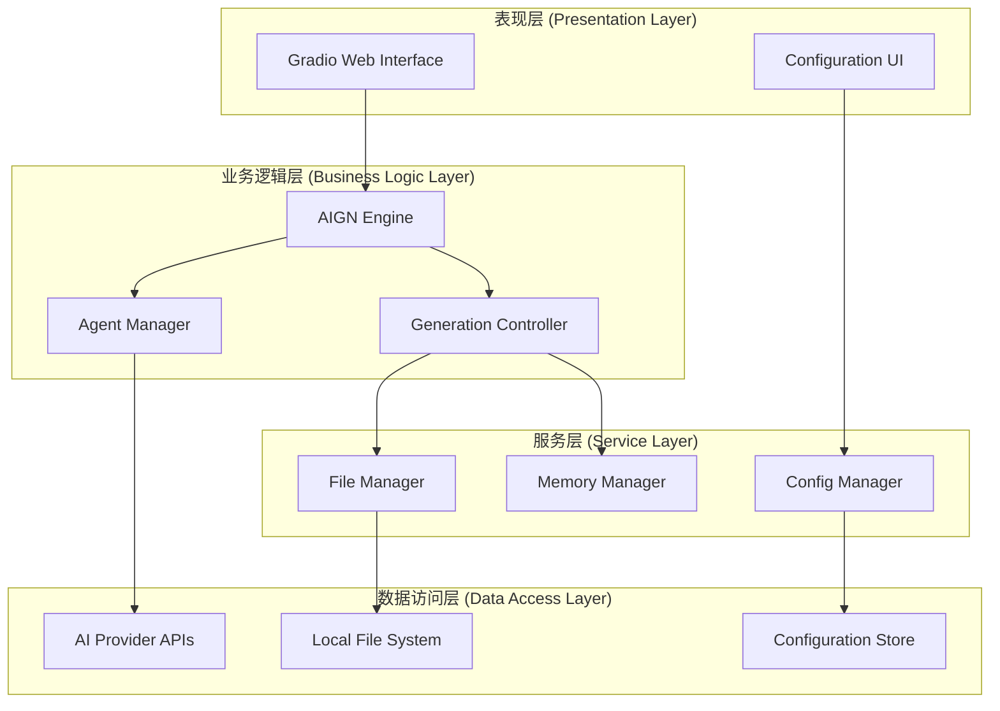
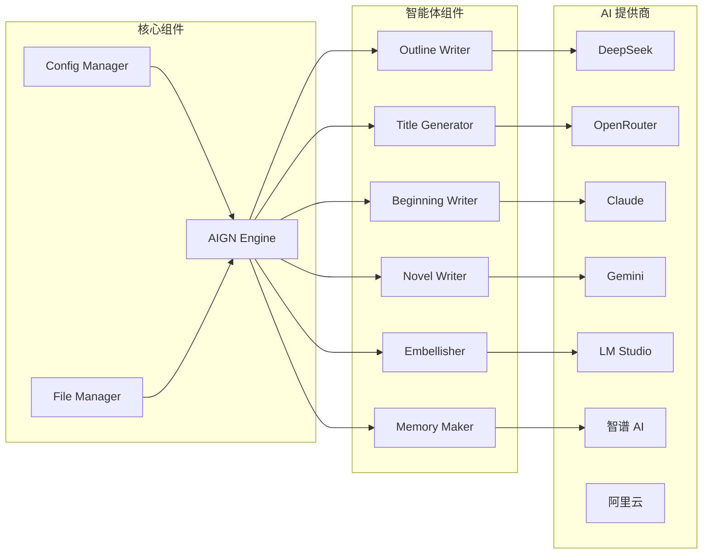
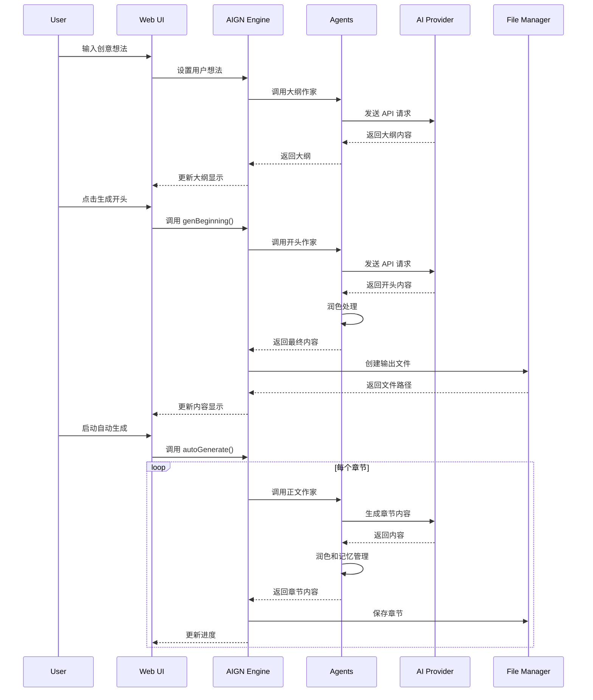
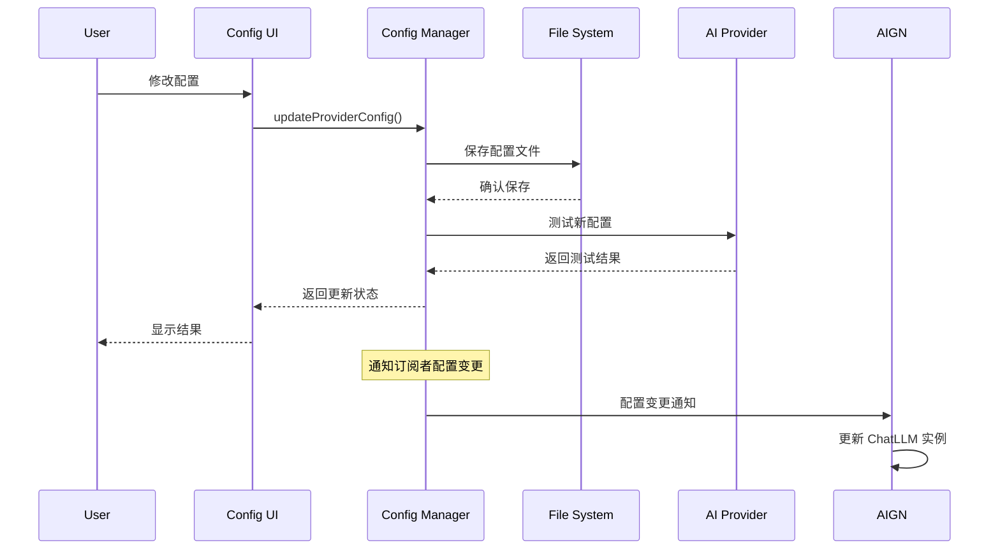

# 架构设计文档

本文档详细描述了 AI 网络小说生成器 v2.0.0 的系统架构设计、技术选型和实现原理。

## 目录

- [系统概览](#系统概览)
- [架构设计原则](#架构设计原则)
- [核心架构](#核心架构)
- [模块设计](#模块设计)
- [数据流设计](#数据流设计)
- [存储设计](#存储设计)
- [安全设计](#安全设计)
- [性能设计](#性能设计)
- [扩展性设计](#扩展性设计)

## 系统概览

### 系统定位

AI 网络小说生成器是一个基于多 AI 提供商的智能创作系统，采用多智能体协作模式，为用户提供从创意到完整小说的全流程自动化生成服务。

### 技术栈

- **后端框架**: Python 3.8+
- **Web 框架**: Gradio (用户界面)
- **AI 集成**: 多 AI 提供商 API
- **配置管理**: 动态配置系统
- **文件系统**: 本地文件存储
- **并发处理**: Python Threading
- **部署方式**: 单机部署 / Docker 容器

### 系统特性

- 🤖 **多 AI 支持**: 支持 7 种主流 AI 提供商
- 🎭 **多智能体**: 6 个专业化智能体协作
- ⚙️ **动态配置**: 运行时配置管理
- 🚀 **自动化**: 批量章节自动生成
- 🎨 **现代界面**: 响应式 Web 界面
- 🔧 **高扩展性**: 模块化插件架构

## 架构设计原则

### 1. 模块化原则

每个功能模块都是独立的，具有清晰的职责边界，便于开发、测试和维护。

```
┌─────────────┐  ┌─────────────┐  ┌─────────────┐
│    UI 层    │  │   配置层    │  │   AI 层     │
└─────────────┘  └─────────────┘  └─────────────┘
        │               │               │
        └───────────────┼───────────────┘
                        │
            ┌─────────────────┐
            │     核心层      │
            └─────────────────┘
```

### 2. 插件化原则

AI 提供商采用插件化设计，支持动态加载和扩展。

### 3. 配置驱动原则

系统行为通过配置文件控制，支持多环境部署。

### 4. 异步处理原则

耗时操作采用异步处理，保证界面响应性。

### 5. 容错性原则

完善的错误处理和恢复机制，保证系统稳定性。

## 核心架构

### 分层架构



### 组件关系图



## 模块设计

### 1. 用户界面层 (UI Layer)

#### 主界面模块 (app.py)

```python
class MainInterface:
    """主界面控制器"""
    
    def __init__(self):
        self.aign_instance = None
        self.config_manager = None
        self.initialize_components()
    
    def create_interface(self):
        """创建 Gradio 界面"""
        pass
    
    def handle_events(self):
        """处理用户交互事件"""
        pass
```

**职责:**
- 界面布局和组件管理
- 用户交互事件处理
- 实时状态更新
- 错误信息展示

#### 配置界面模块 (web_config_interface.py)

```python
class WebConfigInterface:
    """Web 配置界面"""
    
    def create_config_interface(self):
        """创建配置界面组件"""
        pass
    
    def handle_config_update(self):
        """处理配置更新"""
        pass
    
    def test_connection(self):
        """测试 API 连接"""
        pass
```

**职责:**
- AI 提供商配置管理
- API 连接测试
- 配置验证和保存

### 2. 业务逻辑层 (Business Layer)

#### AIGN 引擎 (AIGN.py)

```python
class AIGN:
    """核心生成引擎"""
    
    def __init__(self, chatLLM):
        self.chatLLM = chatLLM
        self.initialize_agents()
    
    def initialize_agents(self):
        """初始化各个智能体"""
        self.novel_outline_writer = NovelOutlineWriter(self.chatLLM)
        self.title_generator = TitleGenerator(self.chatLLM)
        # ... 其他智能体
    
    def genNovelOutline(self):
        """生成小说大纲"""
        pass
    
    def autoGenerate(self, target_chapters):
        """自动生成指定章节数"""
        pass
```

**设计特点:**
- 单一职责：专注于小说生成逻辑
- 状态管理：维护生成过程的所有状态
- 事件驱动：基于事件的生成流程控制

#### 智能体设计

```python
class BaseAgent:
    """智能体基类"""
    
    def __init__(self, chatLLM, system_prompt):
        self.chatLLM = chatLLM
        self.system_prompt = system_prompt
    
    def generate(self, context):
        """生成内容"""
        pass

class NovelOutlineWriter(BaseAgent):
    """大纲作家智能体"""
    
    def generate_outline(self, user_idea):
        """生成小说大纲"""
        pass

class NovelWriter(BaseAgent):
    """正文作家智能体"""
    
    def write_chapter(self, context):
        """写作章节内容"""
        pass
```

**智能体特化:**
- 大纲作家：创建故事结构
- 标题生成器：生成吸引人的标题
- 开头作家：创作引人入胜的开头
- 正文作家：持续推进故事发展
- 润色师：优化文本质量
- 记忆管理器：维护故事连贯性

### 3. 服务层 (Service Layer)

#### 配置管理服务

```python
class DynamicConfigManager:
    """动态配置管理器"""
    
    def __init__(self):
        self.config_data = {}
        self.subscribers = []
    
    def update_config(self, key, value):
        """更新配置并通知订阅者"""
        self.config_data[key] = value
        self.notify_subscribers(key, value)
    
    def subscribe(self, callback):
        """订阅配置变更"""
        self.subscribers.append(callback)
```

**设计模式:**
- 单例模式：全局唯一的配置管理器
- 观察者模式：配置变更通知机制
- 策略模式：多种配置来源策略

#### 文件管理服务

```python
class FileManager:
    """文件管理服务"""
    
    def __init__(self, output_dir="output"):
        self.output_dir = output_dir
        self.ensure_output_dir()
    
    def create_novel_file(self, title, content):
        """创建小说文件"""
        pass
    
    def append_chapter(self, file_path, chapter_content):
        """追加章节内容"""
        pass
    
    def safe_filename(self, filename):
        """生成安全的文件名"""
        pass
```

#### 记忆管理服务

```python
class MemoryManager:
    """记忆管理服务"""
    
    def __init__(self, max_context_length=2000):
        self.max_context_length = max_context_length
        self.memory_cache = {}
    
    def compress_memory(self, content):
        """压缩长文本为记忆"""
        pass
    
    def retrieve_memory(self, key):
        """检索相关记忆"""
        pass
```

### 4. 数据访问层 (Data Layer)

#### AI 提供商抽象

```python
class BaseAI:
    """AI 提供商基类"""
    
    def __init__(self, config):
        self.config = config
        self.client = self.initialize_client()
    
    def __call__(self, messages, **kwargs):
        """统一调用接口"""
        pass
    
    def test_connection(self):
        """测试连接"""
        pass
```

**统一接口设计:**
- 标准化参数：统一的输入输出格式
- 错误处理：统一的异常处理机制
- 流式支持：支持流式和非流式调用

## 数据流设计

### 小说生成流程



### 配置管理流程



## 存储设计

### 配置存储

#### 静态配置文件 (config.py)

```python
# 基础配置结构
CURRENT_PROVIDER = "deepseek"

DEEPSEEK_CONFIG = {
    "api_key": "your-api-key",
    "model_name": "deepseek-chat",
    "base_url": "https://api.deepseek.com",
    "system_prompt": ""
}

# 系统设置
NOVEL_SETTINGS = {
    "default_chapters": 20,
    "enable_chapters": True,
    "enable_ending": True,
    "auto_save": True,
    "output_dir": "output"
}

TEMPERATURE_SETTINGS = {
    "outline_writer": 0.98,
    "beginning_writer": 0.80,
    "novel_writer": 0.81,
    "embellisher": 0.92,
    "memory_maker": 0.66
}
```

#### 动态配置缓存

```python
# 内存中的配置缓存结构
config_cache = {
    "current_provider": "deepseek",
    "providers": {
        "deepseek": {
            "api_key": "***",
            "model_name": "deepseek-chat",
            "base_url": "https://api.deepseek.com",
            "last_tested": "2025-07-04T10:30:00Z",
            "status": "active"
        }
    },
    "settings": {
        "temperature": {...},
        "novel": {...},
        "network": {...}
    }
}
```

### 文件存储

#### 输出文件结构

```
output/
├── 我的小说_20250704_103000.txt
├── 科幻冒险_20250704_120000.txt
└── novel_record.md
```

#### 文件命名规则

```python
def generate_filename(title, timestamp):
    safe_title = re.sub(r'[^\w\s-]', '', title).strip()
    safe_title = re.sub(r'[-\s]+', '_', safe_title)
    return f"{safe_title}_{timestamp.strftime('%Y%m%d_%H%M%S')}.txt"
```

### 内存管理

#### 上下文窗口管理

```python
class ContextManager:
    def __init__(self, max_tokens=4096):
        self.max_tokens = max_tokens
        self.current_context = []
    
    def add_message(self, message):
        """添加消息并管理上下文长度"""
        self.current_context.append(message)
        if self.calculate_tokens() > self.max_tokens:
            self.compress_context()
    
    def compress_context(self):
        """压缩上下文，保留重要信息"""
        # 保留系统提示词和最近的对话
        pass
```

## 安全设计

### API 密钥安全

#### 存储安全

- API 密钥本地存储，不上传到云端
- 配置文件权限控制 (600)
- 内存中的密钥及时清理

#### 传输安全

- 强制使用 HTTPS 连接
- API 密钥不在日志中记录
- 错误信息不泄露敏感数据

```python
class SecureConfig:
    def __init__(self):
        self._sensitive_keys = {'api_key', 'secret', 'token'}
    
    def sanitize_for_log(self, config):
        """清理敏感信息用于日志记录"""
        sanitized = {}
        for key, value in config.items():
            if key.lower() in self._sensitive_keys:
                sanitized[key] = "***"
            else:
                sanitized[key] = value
        return sanitized
```

### 输入验证

```python
class InputValidator:
    @staticmethod
    def validate_api_key(api_key):
        """验证 API 密钥格式"""
        if not api_key or len(api_key) < 10:
            return False, "API 密钥长度不足"
        if api_key.startswith("your-"):
            return False, "请填入真实的 API 密钥"
        return True, "格式正确"
    
    @staticmethod
    def validate_chapter_count(count):
        """验证章节数量"""
        if not isinstance(count, int) or count < 5 or count > 500:
            return False, "章节数量必须在 5-500 之间"
        return True, "数量有效"
```

### 错误处理安全

```python
class SecureErrorHandler:
    @staticmethod
    def handle_api_error(error):
        """安全的 API 错误处理"""
        # 不暴露 API 密钥等敏感信息
        safe_message = str(error)
        if "api_key" in safe_message.lower():
            safe_message = "API 认证失败，请检查密钥设置"
        return safe_message
```

## 性能设计

### 并发处理

#### 异步生成

```python
class AsyncGenerator:
    def __init__(self):
        self.executor = ThreadPoolExecutor(max_workers=4)
        self.generation_queue = Queue()
    
    def submit_generation_task(self, task):
        """提交生成任务"""
        future = self.executor.submit(task)
        return future
    
    def batch_generate(self, tasks):
        """批量生成任务"""
        futures = []
        for task in tasks:
            future = self.submit_generation_task(task)
            futures.append(future)
        return futures
```

#### 流式处理

```python
class StreamProcessor:
    def __init__(self, buffer_size=1024):
        self.buffer_size = buffer_size
        self.buffer = []
    
    def process_stream(self, stream):
        """处理流式数据"""
        for chunk in stream:
            self.buffer.append(chunk)
            if len(self.buffer) >= self.buffer_size:
                yield self.flush_buffer()
        
        if self.buffer:
            yield self.flush_buffer()
    
    def flush_buffer(self):
        """清空缓冲区"""
        result = "".join(self.buffer)
        self.buffer.clear()
        return result
```

### 缓存策略

#### 配置缓存

```python
class ConfigCache:
    def __init__(self, ttl=300):  # 5分钟 TTL
        self.cache = {}
        self.ttl = ttl
        self.timestamps = {}
    
    def get(self, key):
        """获取缓存值"""
        if self.is_expired(key):
            self.cache.pop(key, None)
            self.timestamps.pop(key, None)
            return None
        return self.cache.get(key)
    
    def set(self, key, value):
        """设置缓存值"""
        self.cache[key] = value
        self.timestamps[key] = time.time()
```

#### 内容缓存

```python
class ContentCache:
    def __init__(self, max_size=100):
        self.cache = OrderedDict()
        self.max_size = max_size
    
    def get_or_generate(self, key, generator_func):
        """获取缓存或生成新内容"""
        if key in self.cache:
            # 移到最前面 (LRU)
            self.cache.move_to_end(key)
            return self.cache[key]
        
        # 生成新内容
        content = generator_func()
        self.set(key, content)
        return content
    
    def set(self, key, value):
        """设置缓存，维护大小限制"""
        self.cache[key] = value
        self.cache.move_to_end(key)
        
        if len(self.cache) > self.max_size:
            self.cache.popitem(last=False)
```

### 资源优化

#### 连接池

```python
class ConnectionPool:
    def __init__(self, provider_name, max_connections=10):
        self.provider_name = provider_name
        self.max_connections = max_connections
        self.connections = Queue(maxsize=max_connections)
        self.initialize_connections()
    
    def get_connection(self):
        """获取连接"""
        try:
            return self.connections.get(timeout=5)
        except Empty:
            return self.create_connection()
    
    def return_connection(self, connection):
        """归还连接"""
        if not self.connections.full():
            self.connections.put(connection)
```

## 扩展性设计

### 插件架构

#### AI 提供商插件

```python
class ProviderPlugin:
    """AI 提供商插件基类"""
    
    @abstractmethod
    def get_name(self):
        """获取提供商名称"""
        pass
    
    @abstractmethod
    def get_config_schema(self):
        """获取配置模式"""
        pass
    
    @abstractmethod
    def create_instance(self, config):
        """创建实例"""
        pass

class ProviderRegistry:
    """提供商注册中心"""
    
    def __init__(self):
        self.providers = {}
    
    def register(self, plugin: ProviderPlugin):
        """注册提供商插件"""
        self.providers[plugin.get_name()] = plugin
    
    def get_provider(self, name):
        """获取提供商"""
        return self.providers.get(name)
    
    def list_providers(self):
        """列出所有提供商"""
        return list(self.providers.keys())
```

#### 智能体插件

```python
class AgentPlugin:
    """智能体插件基类"""
    
    @abstractmethod
    def get_name(self):
        """获取智能体名称"""
        pass
    
    @abstractmethod
    def get_system_prompt(self):
        """获取系统提示词"""
        pass
    
    @abstractmethod
    def process(self, context):
        """处理逻辑"""
        pass

class AgentManager:
    """智能体管理器"""
    
    def __init__(self):
        self.agents = {}
    
    def register_agent(self, plugin: AgentPlugin):
        """注册智能体"""
        self.agents[plugin.get_name()] = plugin
    
    def create_pipeline(self, agent_names):
        """创建智能体流水线"""
        pipeline = []
        for name in agent_names:
            if name in self.agents:
                pipeline.append(self.agents[name])
        return pipeline
```

### 配置扩展

#### 配置模式定义

```python
CONFIG_SCHEMA = {
    "providers": {
        "type": "object",
        "properties": {
            "deepseek": {
                "type": "object",
                "properties": {
                    "api_key": {"type": "string", "required": True},
                    "model_name": {"type": "string", "default": "deepseek-chat"},
                    "base_url": {"type": "string", "default": "https://api.deepseek.com"}
                }
            }
        }
    },
    "settings": {
        "type": "object",
        "properties": {
            "temperature": {
                "type": "object",
                "properties": {
                    "outline_writer": {"type": "number", "minimum": 0, "maximum": 2}
                }
            }
        }
    }
}
```

#### 动态配置加载

```python
class DynamicConfigLoader:
    def __init__(self):
        self.config_sources = []
    
    def add_source(self, source):
        """添加配置源"""
        self.config_sources.append(source)
    
    def load_config(self):
        """按优先级加载配置"""
        merged_config = {}
        for source in self.config_sources:
            config = source.load()
            merged_config = self.deep_merge(merged_config, config)
        return merged_config
```

### 接口标准化

#### 统一接口定义

```python
from abc import ABC, abstractmethod
from typing import Iterator, Dict, Any, List

class AIProviderInterface(ABC):
    """AI 提供商标准接口"""
    
    @abstractmethod
    def __call__(self, messages: List[Dict], **kwargs) -> Iterator[Dict]:
        """调用 AI API"""
        pass
    
    @abstractmethod
    def test_connection(self) -> tuple[bool, str]:
        """测试连接"""
        pass
    
    @abstractmethod
    def get_model_info(self) -> Dict[str, Any]:
        """获取模型信息"""
        pass

class AgentInterface(ABC):
    """智能体标准接口"""
    
    @abstractmethod
    def generate(self, context: Dict[str, Any]) -> str:
        """生成内容"""
        pass
    
    @abstractmethod
    def validate_input(self, context: Dict[str, Any]) -> bool:
        """验证输入"""
        pass
```

## 部署架构

### 单机部署

```
┌─────────────────────────────────────┐
│           AI Novel Generator        │
├─────────────────────────────────────┤
│  Gradio Web Server (Port 7860)     │
├─────────────────────────────────────┤
│  Application Layer                  │
│  ├── AIGN Engine                   │
│  ├── Config Manager                │
│  ├── File Manager                  │
│  └── AI Providers                  │
├─────────────────────────────────────┤
│  Local File System                 │
│  ├── config.py                     │
│  ├── output/                       │
│  └── logs/                         │
└─────────────────────────────────────┘
```

### 容器化部署

```dockerfile
FROM python:3.9-slim

# 安装依赖
WORKDIR /app
COPY requirements.txt .
RUN pip install -r requirements.txt

# 复制应用代码
COPY . .

# 创建输出目录
RUN mkdir -p output logs

# 设置权限
RUN chmod 755 /app
RUN chmod 600 config_template.py

# 暴露端口
EXPOSE 7860

# 启动应用
CMD ["python", "app.py"]
```

---

*本架构文档与系统同步更新，如有疑问请查看源码实现或提交 Issue。*