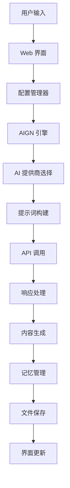

# 开发者文档

本文档为开发者提供详细的技术信息，包括架构设计、API 接口、扩展指南等。

## 目录

- [项目架构](#项目架构)
- [核心模块](#核心模块)
- [AI 提供商集成](#ai-提供商集成)
- [配置系统](#配置系统)
- [扩展开发](#扩展开发)
- [代码规范](#代码规范)
- [测试指南](#测试指南)
- [部署指南](#部署指南)

## 项目架构

### 整体架构

```
AI_Gen_Novel/
├── core/                   # 核心模块
│   ├── AIGN.py            # 主要生成引擎
│   ├── AIGN_Prompt.py     # 提示词管理
│   └── LLM.py             # 语言模型抽象层
├── providers/             # AI 提供商实现
│   ├── uniai/            # 统一 AI 接口
│   │   ├── aliAI.py      # 阿里云通义千问
│   │   ├── claudeAI.py   # Anthropic Claude
│   │   ├── deepseekAI.py # DeepSeek
│   │   ├── geminiAI.py   # Google Gemini
│   │   ├── lmstudioAI.py # LM Studio
│   │   ├── openrouterAI.py # OpenRouter
│   │   └── zhipuAI.py    # 智谱 AI
├── config/               # 配置管理
│   ├── config_manager.py         # 静态配置管理
│   ├── dynamic_config_manager.py # 动态配置管理
│   ├── config_template.py        # 配置模板
│   └── setup_config.py           # 配置初始化
├── ui/                   # 用户界面
│   ├── app.py            # 主界面
│   └── web_config_interface.py   # 配置界面
├── utils/                # 工具模块
│   └── version.py        # 版本管理
└── docs/                 # 文档
    ├── README.md
    ├── INSTALL.md
    ├── FEATURES.md
    ├── CHANGELOG.md
    └── DEVELOPER.md
```

### 数据流向



## 核心模块

### AIGN.py - 生成引擎

核心的小说生成引擎，负责协调各个智能体的工作。

#### 主要类

```python
class AIGN:
    def __init__(self, chatLLM):
        """初始化 AIGN 实例"""
        self.chatLLM = chatLLM
        # 初始化各种智能体
        self.novel_outline_writer = NovelOutlineWriter(chatLLM)
        self.title_generator = TitleGenerator(chatLLM)
        self.novel_beginning_writer = NovelBeginningWriter(chatLLM)
        # ... 其他智能体
```

#### 关键方法

- `genNovelOutline()`: 生成小说大纲
- `genBeginning()`: 生成小说开头
- `genNextParagraph()`: 生成下一段内容
- `autoGenerate(target_chapters)`: 自动生成指定章节数
- `stopAutoGeneration()`: 停止自动生成
- `getProgress()`: 获取生成进度

### LLM.py - 语言模型抽象

提供统一的语言模型接口，支持多种 AI 提供商。

#### 核心接口

```python
def get_chatllm(provider_name, config, allow_incomplete=False):
    """获取指定提供商的 ChatLLM 实例"""
    providers = {
        "deepseek": DeepSeekAI,
        "openrouter": OpenRouterAI,
        "claude": ClaudeAI,
        "gemini": GeminiAI,
        "lmstudio": LMStudioAI,
        "zhipu": ZhipuAI,
        "ali": AliAI
    }
    return providers[provider_name](config)
```

### AIGN_Prompt.py - 提示词管理

管理所有智能体的提示词模板。

#### 提示词结构

```python
SYSTEM_PROMPTS = {
    "outline_writer": "你是一位专业的网络小说大纲作家...",
    "title_generator": "你是一位专业的网络小说标题生成专家...",
    "beginning_writer": "你是一位专业的网络小说开头作家...",
    # ... 其他提示词
}
```

## AI 提供商集成

### 统一接口规范

所有 AI 提供商都需要实现以下接口：

```python
class BaseAI:
    def __init__(self, config):
        self.config = config
        
    def __call__(self, messages, temperature=None, top_p=None, stream=False):
        """主要调用接口"""
        pass
        
    def test_connection(self):
        """测试连接"""
        pass
```

### 新增提供商步骤

1. **创建提供商类**

```python
# uniai/newproviderAI.py
from .base import BaseAI

class NewProviderAI(BaseAI):
    def __init__(self, config):
        super().__init__(config)
        # 初始化 API 客户端
        
    def __call__(self, messages, temperature=None, top_p=None, stream=False):
        # 实现 API 调用逻辑
        pass
```

2. **注册到 LLM.py**

```python
# 在 get_chatllm 函数中添加
providers = {
    # ... 现有提供商
    "newprovider": NewProviderAI,
}
```

3. **添加配置模板**

```python
# config_template.py
NEWPROVIDER_CONFIG = {
    "api_key": "",
    "model_name": "default-model",
    "base_url": "https://api.newprovider.com",
    "system_prompt": ""
}
```

4. **更新 Web 界面**

在 `web_config_interface.py` 中添加新提供商的配置选项。

## 配置系统

### 静态配置 (config_manager.py)

传统的配置文件管理，从 `config.py` 读取配置。

```python
def get_chatllm(allow_incomplete=False):
    """从静态配置获取 ChatLLM 实例"""
    config = load_config()
    provider = config.get('CURRENT_PROVIDER', 'deepseek')
    provider_config = config.get(f'{provider.upper()}_CONFIG', {})
    return create_chatllm_instance(provider, provider_config)
```

### 动态配置 (dynamic_config_manager.py)

运行时可修改的配置管理系统。

```python
class DynamicConfigManager:
    def __init__(self):
        self.config_data = {}
        self.load_config_from_file()
    
    def update_provider_config(self, provider, config_dict):
        """更新提供商配置"""
        self.config_data[f'{provider}_config'] = config_dict
        self.save_config_to_file()
    
    def get_current_config(self):
        """获取当前激活的配置"""
        provider = self.get_current_provider()
        return self.config_data.get(f'{provider}_config')
```

### 配置优先级

1. 动态配置（运行时修改）
2. 静态配置文件 (`config.py`)
3. 默认配置模板

## 扩展开发

### 添加新的智能体

1. **创建智能体类**

```python
class CustomAgent:
    def __init__(self, chatLLM, system_prompt):
        self.chatLLM = chatLLM
        self.system_prompt = system_prompt
    
    def generate(self, user_input, context=""):
        """生成内容"""
        messages = [
            {"role": "user", "content": f"{self.system_prompt}\n\n{user_input}"}
        ]
        return self.chatLLM(messages)
```

2. **添加到 AIGN 类**

```python
class AIGN:
    def __init__(self, chatLLM):
        # ... 现有智能体
        self.custom_agent = CustomAgent(chatLLM, CUSTOM_PROMPT)
```

3. **更新提示词**

在 `AIGN_Prompt.py` 中添加新的提示词模板。

### 添加新功能

1. **后端逻辑**: 在相应模块中实现功能
2. **界面集成**: 在 `app.py` 中添加 UI 组件
3. **事件绑定**: 绑定用户交互事件
4. **测试验证**: 编写测试用例

## 代码规范

### Python 编码规范

- 遵循 PEP 8 标准
- 使用 4 空格缩进
- 行长度不超过 88 字符
- 使用类型注解

### 文档规范

```python
def example_function(param1: str, param2: int = 0) -> dict:
    """
    示例函数的文档字符串
    
    Args:
        param1: 第一个参数的描述
        param2: 第二个参数的描述，默认为 0
    
    Returns:
        dict: 返回值的描述
    
    Raises:
        ValueError: 在什么情况下抛出此异常
    """
    pass
```

### 命名规范

- 类名：PascalCase (例: `ConfigManager`)
- 函数名：snake_case (例: `get_config`)
- 常量：UPPER_SNAKE_CASE (例: `DEFAULT_TIMEOUT`)
- 变量：snake_case (例: `user_input`)

## 测试指南

### 测试结构

```
tests/
├── test_core_functions.py    # 核心功能测试
├── test_config_system.py     # 配置系统测试
├── test_ai_providers.py      # AI 提供商测试
└── test_web_interface.py     # Web 界面测试
```

### 测试用例示例

```python
import unittest
from unittest.mock import Mock, patch

class TestAIGN(unittest.TestCase):
    def setUp(self):
        """测试前的设置"""
        self.mock_chatllm = Mock()
        self.aign = AIGN(self.mock_chatllm)
    
    def test_generate_outline(self):
        """测试大纲生成"""
        self.mock_chatllm.return_value = {"content": "测试大纲", "total_tokens": 100}
        self.aign.user_idea = "测试想法"
        self.aign.genNovelOutline()
        self.assertIn("测试", self.aign.novel_outline)
```

### 运行测试

```bash
# 运行所有测试
python -m pytest tests/

# 运行特定测试文件
python -m pytest tests/test_core_functions.py

# 运行带覆盖率的测试
python -m pytest --cov=. tests/
```

## 部署指南

### 本地开发部署

```bash
# 1. 克隆项目
git clone https://github.com/cs2764/AI_Gen_Novel.git
cd AI_Gen_Novel

# 2. 创建虚拟环境
python -m venv venv
source venv/bin/activate  # Linux/Mac
# 或
venv\Scripts\activate     # Windows

# 3. 安装依赖
pip install -r requirements.txt

# 4. 启动应用
python app.py
```

### Docker 部署

```dockerfile
# Dockerfile
FROM python:3.9-slim

WORKDIR /app
COPY requirements.txt .
RUN pip install -r requirements.txt

COPY . .
EXPOSE 7860

CMD ["python", "app.py"]
```

```bash
# 构建镜像
docker build -t ai-novel-generator .

# 运行容器
docker run -p 7860:7860 ai-novel-generator
```

### 生产环境部署

1. **使用 Gunicorn**

```bash
pip install gunicorn
gunicorn -w 4 -b 0.0.0.0:7860 app:demo
```

2. **使用 Nginx 反向代理**

```nginx
server {
    listen 80;
    server_name your-domain.com;
    
    location / {
        proxy_pass http://127.0.0.1:7860;
        proxy_set_header Host $host;
        proxy_set_header X-Real-IP $remote_addr;
    }
}
```

## 性能优化

### 内存优化

- 使用记忆压缩机制
- 定期清理缓存
- 合理设置上下文长度

### 网络优化

- 实现连接池
- 设置合理的超时时间
- 使用异步请求

### 并发优化

- 使用线程池处理并发请求
- 实现请求队列
- 优化锁的使用

## 监控和日志

### 日志配置

```python
import logging

logging.basicConfig(
    level=logging.INFO,
    format='%(asctime)s - %(name)s - %(levelname)s - %(message)s',
    handlers=[
        logging.FileHandler('app.log'),
        logging.StreamHandler()
    ]
)
```

### 性能监控

- 记录 API 调用时间
- 监控内存使用情况
- 跟踪生成速度

## 常见问题

### Q: 如何添加新的 AI 提供商？
A: 参考 [AI 提供商集成](#ai-提供商集成) 章节的步骤。

### Q: 如何修改提示词？
A: 编辑 `AIGN_Prompt.py` 文件中的对应提示词模板。

### Q: 如何调试 API 调用问题？
A: 启用详细日志，检查 API 密钥和网络连接。

### Q: 如何优化生成质量？
A: 调整温度参数、优化提示词、选择合适的模型。

## 贡献指南

1. Fork 项目
2. 创建特性分支 (`git checkout -b feature/amazing-feature`)
3. 提交更改 (`git commit -m 'Add amazing feature'`)
4. 推送到分支 (`git push origin feature/amazing-feature`)
5. 创建 Pull Request

## 许可证

本项目采用 MIT 许可证，详见 [LICENSE](LICENSE) 文件。

---

*本文档持续更新中，如有疑问请提交 Issue。*