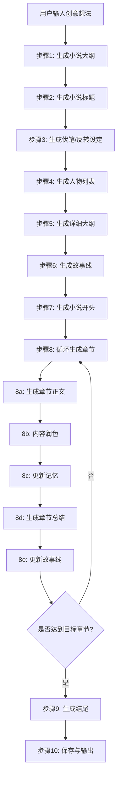

# AIGN 小说自动生成工作流 (AI Novel Generation Workflow)

本技能文件详细描述了 AI 小说生成器（AIGN）从用户输入到生成完整小说的全部工作流步骤。
系统通过多智能体（Multi-Agent）协作模式，以结构化流程自动创作网络小说。

---

## 系统架构总览

```
用户输入创意 → 大纲 → 标题 → 伏笔 → 人物列表 → 详细大纲 → 故事线
    → 开头 → [循环: 正文 → 润色 → 记忆更新 → 章节总结] → 结尾 → 完整小说
```

### 核心组件

| 组件 | 文件 | 职责 |
|------|------|------|
| 主引擎 | `AIGN.py` | 核心生成逻辑与状态管理 |
| 智能体 | `aign_agents.py` | `MarkdownAgent` / `JSONMarkdownAgent` 基类 |
| 大纲生成器 | `aign_outline_generator.py` | 大纲、标题、伏笔、人物列表、详细大纲 |
| 故事线管理器 | `aign_storyline_manager.py` | 故事线分批生成与管理 |
| 增强故事线生成器 | `enhanced_storyline_generator.py` | JSON 结构化输出与多方法回退 |
| 章节管理器 | `aign_chapter_manager.py` | 单章正文生成与润色 |
| 开头/结尾管理器 | `aign_beginning_ending_manager.py` | 开头章节与结尾章节 |
| 记忆管理器 | `aign_memory_manager.py` | 写作记忆、章节总结、故事线更新 |
| 大纲优化器 | `aign_outline_optimizer.py` | 精简模式下减少 Token 消耗 |
| 设定优化器 | `aign_setting_optimizer.py` | 防止临时设定无限增长 |
| 动态剧情结构 | `dynamic_plot_structure.py` | 根据总章节数自动规划剧情结构 |
| 防重复机制 | `AIGN_Anti_Repetition_Prompt.py` | 段落/句子/词汇级别防重复 |
| 需求扩展器 | `AIGN_Requirements_Expansion_Prompt.py` | AI 扩展写作与润色需求 |
| 提示词中心 | `AIGN_Prompt_Enhanced.py` | 集中导入/导出所有提示词 |
| 提示词模块目录 | `prompts/` | 分模块化的提示词定义 |

### 智能体列表

| Agent 名称 | 类型 | Temperature | 职责 |
|------------|------|-------------|------|
| NovelOutlineWriter | MarkdownAgent | 0.95 | 生成小说大纲 |
| TitleGenerator | MarkdownAgent | provider | 生成小说标题 |
| TitleGeneratorJSON | JSONMarkdownAgent | provider | 标题生成（JSON备用方案） |
| ForeshadowingGenerator | MarkdownAgent | 0.95 | 生成伏笔/反转设定 |
| CharacterGenerator | MarkdownAgent | 0.95 | 生成人物列表 |
| DetailedOutlineGenerator | MarkdownAgent | provider | 生成详细大纲 |
| StorylineGenerator | JSONMarkdownAgent | 0.95 | 生成故事线 |
| NovelBeginningWriter | MarkdownAgent | base | 生成小说开头 |
| NovelWriter | MarkdownAgent | provider | 标准模式正文生成 |
| NovelWriterCompact | MarkdownAgent | provider | 精简模式正文生成 |
| NovelEmbellisher | MarkdownAgent | provider | 标准模式内容润色 |
| NovelEmbellisherCompact | MarkdownAgent | provider | 精简模式内容润色 |
| MemoryMaker | MarkdownAgent | base | 生成/更新写作记忆 |
| ChapterSummaryGenerator | MarkdownAgent | base | 生成章节总结 |
| EndingWriter | MarkdownAgent | base | 生成结尾 |
| EndingEmbellisher | MarkdownAgent | base | 结尾润色 |
| NovelWriterSeg1-4 | MarkdownAgent | provider | 长章节分段正文 |
| NovelEmbellisherSeg1-4 | MarkdownAgent | provider | 长章节分段润色 |
| NovelWriterCompactSeg1-4 | MarkdownAgent | provider | 精简长章节分段正文 |
| NovelEmbellisherCompactSeg1-4 | MarkdownAgent | provider | 精简长章节分段润色 |

---

## 完整生成流程



---

## 步骤0: 用户输入与初始化

### 用户提供的输入

| 输入项 | 说明 | 必填 |
|--------|------|------|
| `user_idea` | 创意想法 / 故事灵感 | ✅ |
| `user_requirements` | 写作要求（风格、叙事方式等） | 可选 |
| `embellishment_idea` | 润色要求（文学性提升方向） | 可选 |
| `target_chapter_count` | 目标章节数（默认20） | 可选 |
| `foreshadowing_count` | 伏笔数量（默认3） | 可选 |
| `compact_mode` | 精简模式开关（默认True） | 可选 |
| `long_chapter_mode` | 长章节模式（0/2/3/4段） | 可选 |
| `style_name` | 写作风格选择 | 可选 |
| `chapters_per_plot` | 每个剧情单元章节数（默认5） | 可选 |
| `num_climaxes` | 高潮总数（默认10） | 可选 |

### 写作风格选项

系统提供 30+ 种写作风格模板，每种风格有专用的 writer 和 embellisher 提示词。
风格文件位于 `prompts/standard/` 和 `prompts/compact/` 目录下：

- 通用、穿越、都市、毒心、科幻、仙侠、玄幻、悬疑、升级、系统
- 金庸风、古言、奇幻、人情、四合院、填充、替身、同人、武侠
- 女频-甜虐、女频-耽美、脑洞、末世、规则怪谈、直播、娱乐、追妻
- 主天、放鸽、番茄、知乎、雪花、灵感、幻原、儿童-绘本、儿童-童话、幼儿
- Snyder模式

### 初始化过程

```
1. 创建 AIGN 实例 → 初始化所有 Agent
2. 配置 AI 提供商（OpenRouter / DeepSeek / Claude / Gemini / 通义 / LMStudio 等）
3. 设置 Temperature（默认 0.7）
4. 加载防重复机制（如果可用）
5. 初始化自动保存管理器
6. 初始化小说存档管理器
```

---

## 步骤1: 生成小说大纲

**执行方法:** `AIGN.genNovelOutline()` / `OutlineGenerator.generate_outline()`
**负责Agent:** `NovelOutlineWriter`（Temperature: 0.95）
**提示词文件:** `prompts/common/outline_prompt.py`

### 输入

```python
inputs = {
    "用户想法": self.user_idea,          # 用户的创意灵感
    "写作要求": self.user_requirements,   # 写作风格要求
    "目标章节数": target_chapter_count,   # 目标章节数（传递给Agent参考）
    "风格参考": rag_references,           # RAG检索的风格参考（如果启用）
}
```

### 输出

```markdown
# 大纲
包含：故事设定、主要人物概述、世界观、开端→发展→高潮→结局的框架
# END
```

### 关键特性

- Agent Temperature 固定为 0.95（高创造性），不随提供商设置变化
- 支持 RAG 风格学习：从参考文本中检索风格参考
- 生成完成后自动保存到本地文件
- 生成完成后保存元数据（不保存小说正文）
- 大纲生成后会**重置详细大纲状态**，确保后续流程使用新大纲

### 提示词设计原则

大纲生成器扮演 **"才华横溢的网络小说作家"** 角色，工作流程包括：
1. 深入挖掘用户的创意火花
2. 设计魅力四射的开场
3. 精心设计高潮环节
4. 设计反转与惊奇
5. 设计富有深意的结局
6. 保持创意新鲜感
7. 输出精细化的小说大纲

---

## 步骤2: 生成小说标题

**执行方法:** `AIGN.genNovelTitle()` / `OutlineGenerator.generate_title()`
**负责Agent:** `TitleGenerator` + `TitleGeneratorJSON`（备用）
**提示词文件:** `prompts/common/title_prompt.py`

### 三重回退机制

```
方法1: Markdown格式生成（TitleGenerator.invoke）
  ↓ 失败
方法2: JSON格式生成（TitleGeneratorJSON.invokeJSON）
  ↓ 失败
方法3: 简化调用（去除可选输入，再次尝试）
  ↓ 失败
使用默认标题 "未命名小说"
```

每种方法失败后还支持**最多2次重试**（共3轮尝试 × 3种方法 = 最多9次调用）。

### 输入

```python
inputs = {
    "用户想法": self.user_idea,
    "写作要求": self.user_requirements,
    "小说大纲": self.getCurrentOutline()
}
```

### 输出

```markdown
# 标题
小说的标题文本
# END
```

或 JSON 格式：
```json
{"title": "标题文本", "reasoning": "创作理由"}
```

### 后续操作

- 标题生成成功后立即调用 `initOutputFile()` 初始化输出文件名
- 自动保存标题到本地文件

---

## 步骤3: 生成伏笔/反转设定

**执行方法:** `OutlineGenerator.generate_foreshadowing()`
**负责Agent:** `ForeshadowingGenerator`（Temperature: 0.95）
**提示词文件:** `prompts/common/foreshadowing_prompt.py`

### 执行时机

在大纲和标题生成之后、人物列表生成之前调用。
因为人物列表尚未生成，伏笔设定中**不包含具体人名**，仅使用抽象角色引用。

### 输入

```python
inputs = {
    "大纲": current_outline,
    "用户想法": self.user_idea,
    "写作要求": self.user_requirements,
    "伏笔数量": str(foreshadowing_count),  # 默认3
    "风格参考": rag_references,
}
```

### 输出

```markdown
# 伏笔与反转设定
伏笔1: ...
伏笔2: ...
伏笔3: ...
# END
```

### 伏笔类型

系统支持生成以下类型的伏笔：
- **身份型**: 隐藏身份的揭示
- **物品型**: 关键道具/宝物的作用
- **事件型**: 过去/未来事件的线索
- **关系型**: 人物关系的隐藏联系
- **能力型**: 隐藏能力或限制的揭示
- **历史型**: 历史事件的真相
- **环境型**: 世界/环境的隐藏规则

### 伏笔结构

每个伏笔包含：
- 伏笔类型（identity/object/event/relationship/ability/history/environment）
- 埋设阶段（early/mid/late）
- 揭示阶段
- 线索描述
- 对剧情的影响
- 伏笔网络（小伏笔服务大伏笔的关系）

### 特殊说明

- 伏笔数量设为0时跳过此步骤
- 生成的伏笔会注入到后续的详细大纲、故事线、正文生成中
- 通过 `_inject_foreshadowing_to_inputs()` 方法统一注入

---

## 步骤4: 生成人物列表

**执行方法:** `AIGN.genCharacterList()` / `OutlineGenerator.generate_character_list()`
**负责Agent:** `CharacterGenerator`（Temperature: 0.95）
**提示词文件:** `prompts/common/character_prompt.py`

### 输入

```python
inputs = {
    "大纲": current_outline,
    "用户想法": self.user_idea,
    "写作要求": self.user_requirements,
    "伏笔设定": foreshadowing,    # 如果已生成伏笔
    "风格参考": rag_references,
}
```

### 输出

结构化的人物列表（Markdown 或 JSON 格式），包含：
- **基本信息**: 姓名、年龄、外貌描写
- **性格特点**: 核心性格与性格层次
- **背景故事**: 角色的过往经历
- **特殊能力**: 技能与特长
- **角色关系网络**: 与其他角色的关系
- **主要人物 / 配角分类**

### 重试机制

最多重试2次（共3轮尝试），失败时设置默认值 "暂未生成人物列表" 并继续流程。

### 后续操作

- 自动保存人物列表到本地文件
- 人物列表将在后续所有正文生成步骤中作为上下文提供

---

## 步骤5: 生成详细大纲

**执行方法:** `AIGN.genDetailedOutline()` / `OutlineGenerator.generate_detailed_outline()`
**负责Agent:** `DetailedOutlineGenerator`
**提示词文件:** `prompts/common/detailed_outline_prompt.py`

### 核心目的

将步骤1生成的简略大纲扩展为包含章节级别规划的详细大纲。详细大纲生成后将替代原始大纲，后续所有步骤使用详细大纲作为基础。

### 动态剧情结构

系统根据目标章节数自动生成适合的剧情结构：

| 章节数 | 结构类型 | 说明 |
|--------|----------|------|
| ≤10 | 短篇三幕式 | 开篇/发展-高潮/结尾 |
| 11-30 | 中篇四幕式 | 开篇/发展/高潮/结尾 |
| 31-60 | 长篇五幕式 | 开篇/初步发展/第一高潮/深入发展/终极高潮/结尾 |
| 60+ | 史诗多高潮 | 每12章一个高潮，≥5个高潮点，交替的发展→高潮循环 |

用户可通过 `chapters_per_plot`（每个剧情单元章节数）和 `num_climaxes`（高潮数量）自定义剧情紧凑度。

### 输入

```python
inputs = {
    "原始大纲": self.novel_outline,
    "目标章节数": str(self.target_chapter_count),
    "用户想法": self.user_idea,
    "写作要求": self.user_requirements,
    "剧情结构信息": structure_info,    # 动态生成的剧情结构
    "模式说明": mode_guide_text,       # 精简/长章节模式的优化建议
    "人物列表": self.character_list,    # 如果已生成
    "伏笔设定": foreshadowing,          # 如果已生成
    "风格参考": rag_references,
}
```

### 输出

```markdown
# 详细大纲
为每个章节提供：章节目标、核心冲突、关键行动、结果、承接下一章的钩子
# END
```

### 后续操作

- 设置 `use_detailed_outline = True`
- `getCurrentOutline()` 方法将优先返回详细大纲
- 自动保存到本地文件

---

## 步骤6: 生成故事线

**执行方法:** `AIGN.genStoryline()` → `StorylineManager.generate_storyline()`
**负责Agent:** `StorylineGenerator` + `EnhancedStorylineGenerator`
**提示词文件:** `prompts/common/storyline_prompt.py`

### 分批生成

故事线按每批次10章（默认）分批生成，避免单次生成过长导致质量下降。

```
总章节 100 → 分10批 → 每批10章 → 逐批生成并合并
```

### 增强的JSON生成策略（四重回退）

```
方法1: Structured Outputs（仅 OpenRouter）
  → 使用 JSON Schema 强制格式
  ↓ 失败
方法2: Tool Calling（仅 OpenRouter）
  → 使用函数定义确保格式
  ↓ 失败
方法3: 传统方法 + JSON 修复（所有提供商）
  → 流式生成 + json_repair 库 + 智能修复
  → 最多3次尝试，每次降低 Temperature
  ↓ 失败
方法4: 渐进式生成
  → 缩小批次（5→3→1章）逐步尝试
  ↓ 全部失败
跳过该批次，记录错误
```

### 输入

```python
inputs = {
    "大纲": self.getCurrentOutline(),         # 详细大纲或原始大纲
    "人物列表": self.character_list,
    "用户想法": self.user_idea,
    "写作要求": self.user_requirements,
    "章节范围": f"{start}-{end}章",
    "详细大纲": self.detailed_outline,          # 如果不同于当前大纲
    "基础大纲": self.novel_outline,             # 如果不同于当前大纲
    "前置故事线": prev_storyline,               # 前一批次的最后5章
    "伏笔设定": foreshadowing,                  # 如果已生成
}
```

### 输出（JSON格式）

```json
{
  "chapters": [
    {
      "chapter_number": 1,
      "title": "章节标题",
      "plot_summary": "剧情概要",
      "main_characters": ["角色A", "角色B"],
      "key_events": ["事件1", "事件2"],
      "plot_purpose": "剧情目的",
      "emotional_tone": "情感基调",
      "transition_to_next": "承接下一章的要素",
      "plot_segments": [
        {
          "index": 1,
          "segment_title": "分段标题",
          "segment_summary": "分段概要",
          "segment_key_events": ["关键事件"],
          "segment_purpose": "分段目的",
          "segment_transition": "过渡描述"
        }
      ]
    }
  ]
}
```

### 章节命名策略

系统要求每章标题使用多样化命名风格：
- 事件命名法（基于核心事件）
- 角色命名法（基于关键角色）
- 情感命名法（基于情感基调）
- 场景命名法（基于关键场景）
- 转折命名法（基于剧情转折点）
- 悬念命名法（基于悬念/疑问）

### 验证与修复

每批次生成后进行验证：
- 章节号连续性检查
- 必要字段完整性检查
- 数据结构合法性检查
- 截断检测（JSON未闭合、括号不匹配等）

### 后续操作

- 合并到总故事线 `self.storyline["chapters"]`
- 自动保存故事线到本地文件
- 生成故事线总结报告

---

## 步骤7: 生成小说开头

**执行方法:** `AIGN.genBeginning()` → `BeginningEndingManager.generate_beginning()`
**负责Agent:** `NovelBeginningWriter` + `NovelEmbellisher`
**提示词文件:** `prompts/standard/beginning_prompt.py`

### 执行前准备

1. 刷新 ChatLLM 配置
2. 刷新 Fish Audio S2 语气标记模式
3. 应用选定的写作风格提示词（更新 writer/embellisher Agent）
4. 获取第一章故事线信息

### 输入

```python
inputs = {
    "用户想法": self.user_idea,
    "小说大纲": self.getCurrentOutline(),
    "人物列表": self.character_list,
    "故事线": str(self.storyline),
    "写作要求": user_requirements,
    "润色要求": embellishment_idea,
    "第一章故事线": first_chapter_storyline,  # 标题、剧情概要、关键事件
    "伏笔设定": foreshadowing,                # 如果已生成
}
```

### 生成流程

```
1. 调用 NovelBeginningWriter → 获得原始开头 + 写作计划 + 临时设定
2. 调用 NovelEmbellisher → 润色开头内容
3. 文本清理（去除结构标记）
4. 添加第一章标题（从故事线获取）
5. 追加到 paragraph_list
6. 更新 novel_content
7. chapter_count = 1
```

### 输出结构

```markdown
# 段落（开头内容）
引人入胜的小说开头...
# 计划
接下来的剧情发展方向
# 临时设定
与开头相关的临时设定信息
# END
```

### 开头写作要求

- 清晰交代主角身份和初始处境
- 营造吸引人的开场氛围
- 设置初始冲突或悬念
- 预示故事的基调和风格

---

## 步骤8: 循环生成章节正文

**执行方法:** `AIGN.genNextParagraph()` → `ChapterManager.generate_chapter()`
**负责Agent:** Writer + Embellisher + MemoryMaker + ChapterSummaryGenerator

### 单章生成流程

```
对每一章（chapter_count < target_chapter_count）：
  │
  ├─ 8a. 生成章节正文
  │   ├─ 获取增强上下文（前5章总结、后5章大纲、上一章全文）
  │   ├─ 获取当前章节故事线
  │   ├─ 调用 Writer Agent → 原始段落 + 计划 + 临时设定
  │   └─ [如果启用故事线] 检查并补充缺失的故事线批次
  │
  ├─ 8b. 内容润色
  │   ├─ 调用 Embellisher Agent → 润色后的段落
  │   └─ [精简模式] 调用 SettingOptimizer 优化临时设定
  │
  ├─ 8c. 更新记忆
  │   ├─ 累积 no_memory_paragraph
  │   ├─ 当 no_memory_paragraph > 2000字 时触发记忆更新
  │   └─ 调用 MemoryMaker Agent → 更新后的 writing_memory
  │
  ├─ 8d. 生成章节总结
  │   ├─ 调用 ChapterSummaryGenerator → JSON格式的章节总结
  │   └─ 包含：标题、剧情概要、主要人物、关键事件
  │
  ├─ 8e. 更新故事线
  │   ├─ 将章节总结写入 storyline 数据结构
  │   └─ 排序章节确保顺序正确
  │
  ├─ 添加章节标题
  ├─ 追加到 paragraph_list 和 novel_content
  ├─ chapter_count += 1
  ├─ 自动保存到本地文件
  └─ 自动保存存档（每章）
```

### 两种运行模式

#### 标准模式 (compact_mode = False)

使用 `NovelWriter` + `NovelEmbellisher`

Writer 输入包含完整上下文：
```python
inputs = {
    "用户想法": self.user_idea,
    "小说大纲": self.getCurrentOutline(),
    "人物列表": self.character_list,
    "前文记忆": self.writing_memory,
    "临时设定": self.temp_setting,
    "写作计划": self.writing_plan,
    "写作要求": user_requirements,
    "润色要求": embellishment_idea,
    "上一段": last_paragraph,
    "本章故事线": current_storyline,
    "前五章故事线摘要": prev_5_summaries,
    "后五章故事线大纲": next_5_outlines,
    "上一章全文": last_chapter_full_text,
    "伏笔设定": foreshadowing,
}
```

#### 精简模式 (compact_mode = True)

使用 `NovelWriterCompact` + `NovelEmbellisherCompact`

精简输入（大幅减少 Token 消耗）：
```python
inputs = {
    "小说大纲": optimized_outline,       # 使用 OutlineOptimizer 精简
    "写作要求": writing_requirements,
    "前文记忆": self.writing_memory,      # 限制300字
    "临时设定": self.temp_setting,        # 限制300字
    "写作计划": self.writing_plan,
    "本章故事线": current_storyline,
    "前二章故事线": prev_2_summaries,
    "后二章故事线": next_2_outlines,
    "伏笔设定": foreshadowing,
}
```

精简模式的优化措施：
- 使用 `OutlineOptimizer` 提取当前章节 ±3 范围的大纲
- 记忆限制 300 字（标准模式 2000 字）
- 临时设定限制 300 字（标准模式 800 字）
- 前后故事线范围缩小到 ±2 章
- 不发送上一章全文

### 长章节模式 (4段合并)

当 `long_chapter_mode > 0` 时，每章拆分为2/3/4个独立段落分别生成并润色后合并：

```
章节 → [段1: Writer→Embellisher] → [段2: Writer→Embellisher]
      → [段3: Writer→Embellisher] → [段4: Writer→Embellisher] → 合并
```

使用专用的分段 Agent（`NovelWriterSeg1-4` / `NovelEmbellisherSeg1-4`）

每段上下文包含：
- 当前段的故事线分段信息（`plot_segments[i]`）
- 其他3段的概要（作为参考）
- 前2章总结（非全文）
- 后2章大纲

Token 优化效果：传统模式 50,000+ 字上下文 → 长章节模式 ~1,600 字上下文

### Writer 输出格式

```markdown
# 段落
接下来的小说正文内容...
# 计划
简述接下来的剧情发展方向
# 临时设定
与即将发展的剧情相关的临时设定
# END
```

### Embellisher（润色器）工作要点

- 丰富环境描写和感官细节
- 深化心理刻画和情感表达
- 优化语言节奏和韵律
- 增强画面感和沉浸感
- 标准模式目标：润色到约5000字
- 保持剧情一致性，不改变情节走向

### 防重复机制

在 Writer 和 Embellisher 的提示词中自动注入防重复规则：

**Writer 防重复:**
- 记忆追踪：最近5段开头、最近10个过渡词、最近3次场景切换
- 强制变化：上段以动作开头 → 本段必须以环境/对话/心理开头
- 每段必须有独特元素（比喻/细节/情感/节奏）

**Embellisher 防重复:**
- 描写方法轮换：感官→心理→环境→动作→对话潜台词（循环）
- 相同修辞手法间隔 ≥200 字
- 句子长度变化：短句(5-10字)/中句(15-25字)/长句(30+字) 必须交替

---

## 步骤8c: 记忆管理（详细）

**执行方法:** `MemoryManager.update_memory()`
**负责Agent:** `MemoryMaker`

### 触发条件

`no_memory_paragraph` 累积超过 2000 字符时触发记忆更新。

### 记忆长度限制

| 模式 | 最大长度 | 目标长度 |
|------|----------|----------|
| 标准模式 | 2000字 | 1800字 |
| 精简模式 | 300字 | 250字 |
| 长章节精简模式 | 500字 | 400字 |

### 截断策略

在目标长度处找最近的句号（`。`）或间隔号（`·`），在句子边界截断。

### 记忆层次

```
长期记忆（固定不变）
├─ 大纲和设定
├─ 人物信息
└─ 世界观设定

中期记忆（滚动更新）
├─ 最近5章内容摘要
├─ 重要剧情点
└─ 人物发展轨迹

短期记忆（每章更新）
├─ 当前章节上下文
├─ 临时设定（temp_setting）
└─ 即时状态
```

---

## 步骤8d: 章节总结生成

**执行方法:** `MemoryManager.generate_chapter_summary()`
**负责Agent:** `ChapterSummaryGenerator`
**提示词文件:** `prompts/common/chapter_summary_prompt.py`

### 输入

```python
inputs = {
    "章节内容": chapter_content,
    "章节号": chapter_number,
    "原故事线": original_storyline,    # 该章节的原始故事线
    "人物信息": self.character_list,
}
```

### 输出（JSON格式）

```json
{
  "title": "章节标题",
  "plot_summary": "剧情概要",
  "main_characters": ["角色A", "角色B"],
  "key_events": ["关键事件1", "关键事件2"]
}
```

### 重试机制

最多重试2次，每次间隔2秒。

---

## 步骤8e: 故事线更新

**执行方法:** `MemoryManager.update_storyline_with_summary()`

### 更新内容

将章节总结写回故事线数据结构，更新以下字段：
```python
{
    "chapter_number": chapter_number,
    "title": summary["title"],
    "plot_summary": summary["plot_summary"],
    "main_characters": summary["main_characters"],
    "key_events": summary["key_events"],
    "plot_purpose": original.get("plot_purpose", ""),
    "emotional_tone": original.get("emotional_tone", ""),
    "transition_to_next": original.get("transition_to_next", "")
}
```

更新后按 `chapter_number` 排序所有章节。

---

## 步骤9: 生成结尾

**执行方法:** `BeginningEndingManager.generate_ending_chapter()`
**负责Agent:** `EndingWriter` + `EndingEmbellisher`
**提示词文件:** `prompts/standard/ending_prompt.py`

### 触发条件

- `enable_ending = True`（默认启用）
- `chapter_count >= target_chapter_count`

### 生成流程

与标准章节生成流程相似，但使用专用的结尾 Agent：
1. 调用 `EndingWriter` → 生成结尾内容
2. 调用 `EndingEmbellisher` → 润色结尾
3. `is_final = True` 标记为最终章节

支持标准模式和精简模式。
长章节模式下使用 `EndingWriterSeg1-4` 分段生成。

---

## 步骤10: 保存与输出

### 输出文件结构

```
output/
├─ 小说标题_完整版.md          # 完整的小说内容
├─ 小说标题_chapters/          # 章节分割版本
│  ├─ 第1章.md
│  ├─ 第2章.md
│  └─ ...
├─ 小说标题.epub              # EPUB格式（可选）
└─ 小说标题_metadata.json     # 元数据信息
```

### 元数据内容

```json
{
    "title": "小说标题",
    "outline": "大纲内容",
    "character_list": "人物列表",
    "storyline": { "chapters": [...] },
    "chapter_count": 100,
    "target_chapters": 100,
    "generation_time": "2025-07-23T12:00:00",
    "user_idea": "用户创意",
    "user_requirements": "写作要求",
    "embellishment_idea": "润色要求"
}
```

### 自动保存机制

- **每章自动保存**: 每生成完一章立即保存
- **自动保存管理器**: `auto_save_manager` 管理本地自动保存
- **小说存档管理器**: `novel_save_manager` 管理存档点（可恢复）
- **本地数据安全**: 敏感数据和用户文件仅保存在本地，不上传

---

## 自动生成模式 (autoGenerate)

**执行方法:** `AIGN.autoGenerate(target_chapters=None)`

### 全自动流程

```python
def autoGenerate():
    # 1. 初始化统计系统
    reset_token_accumulation_stats()
    start_api_time_tracking()
    reset_siliconflow_cache_stats()
    
    # 2. 刷新 ChatLLM 配置
    _refresh_chatllm_for_auto_generation()
    
    # 3. 检查前置条件（如果没有开头）
    if not has_beginning:
        # 3a. 检查并生成详细大纲
        if not detailed_outline:
            genDetailedOutline()
        
        # 3b. 检查并生成人物列表
        if not character_list:
            genCharacterList()
        
        # 3c. 检查并生成故事线
        if not storyline:
            genStoryline()
        
        # 3d. 初始化输出文件
        initOutputFile()
        
        # 3e. 生成开头
        genBeginning()
    
    # 4. 循环生成章节
    while chapter_count < target_chapter_count:
        # 每5章检查配置更新
        if chapter_count % 5 == 0:
            _refresh_chatllm_for_auto_generation()
        
        # 刷新最新的写作/润色要求
        _refresh_webui_settings()
        
        # 生成下一章
        genNextParagraph()
        
        # 保存存档
        save_novel_progress()
        
        # LM Studio 定期重载模型
        check_lmstudio_reload()
    
    # 5. 生成结尾（如果启用）
    if enable_ending:
        genEnding()
    
    # 6. 最终统计报告
    print_token_report()
    print_time_report()
```

### 断点续生成

系统支持从中断处继续生成：
- 检测 `chapter_count > 0` 时自动进入续写模式
- 跳过已完成的步骤（大纲、人物、故事线等）
- 从 `chapter_count + 1` 章继续

### 错误处理

- API 调用使用 `@Retryer(max_retries=10)` 装饰器自动重试
- 连续3次解析失败 → 自动停止生成
- 每章生成失败后自动修正 `chapter_count`
- 异常后自动保存进度

### 统计系统

自动生成期间追踪以下数据：
- **Token统计**: 各Agent发送/接收的Token数量
- **时间统计**: API调用时间、章节生成时间、预计剩余时间
- **费用统计**: 基于Token数量和价格估算API费用
- **SiliconFlow缓存统计**: 缓存命中率

---

## 需求智能扩展 (Requirements Expansion)

**文件:** `AIGN_Requirements_Expansion_Prompt.py`
**文件:** `app_ai_expansion.py`

### 写作要求扩展

用户简短的写作要求 → AI 自动扩展为详细的写作指南：
- **精简版** (600-800字): 适用于精简模式
- **完整版** (1200-1800字): 适用于标准模式

扩展维度：
1. 词汇选择与搭配
2. 句式构造与语法特色
3. 叙事技巧
4. 描写手法
5. 对话艺术
6. 修辞运用
7. 韵律与节奏
8. 风格统一性

### 风格分析

9维度风格分析框架：
1. 文学类型定位
2. 语言风格基调
3. 目标受众画像
4. 情感表达特征
5. 文本表现力
6. 角色塑造手法
7. 世界观构建
8. 叙事技巧运用
9. 商业价值定位

### 题材专用模板

针对不同题材生成专属写作指南：
武侠、言情、科幻、玄幻、悬疑、都市、仙侠、历史、恐怖、末日

---

## 提示词模块化架构

```
prompts/
├── common/                     # 通用提示词（所有模式共享）
│   ├── outline_prompt.py       # 大纲生成
│   ├── title_prompt.py         # 标题生成
│   ├── character_prompt.py     # 人物生成
│   ├── detailed_outline_prompt.py  # 详细大纲
│   ├── storyline_prompt.py     # 故事线生成
│   ├── storyline_prompt_simple.py  # 简化故事线
│   ├── chapter_summary_prompt.py   # 章节总结
│   ├── memory_prompt.py        # 记忆生成
│   ├── foreshadowing_prompt.py # 伏笔生成
│   └── humanizer_rules.py     # Humanizer规则
│
├── standard/                   # 标准模式提示词
│   ├── base_writer_template.py     # Writer基础模板
│   ├── base_embellisher_template.py # Embellisher基础模板
│   ├── beginning_prompt.py     # 开头生成
│   ├── ending_prompt.py        # 结尾生成
│   ├── long_chapter_prompt.py  # 长章节
│   ├── segment_prompts.py      # 分段提示词
│   ├── writer_prompt.py        # 默认Writer
│   ├── writer_prompt_*.py      # 各风格Writer（30+种）
│   ├── embellisher_prompt.py   # 默认Embellisher
│   └── embellisher_prompt_*.py # 各风格Embellisher（30+种）
│
├── compact/                    # 精简模式提示词
│   ├── base_writer_template.py
│   ├── base_embellisher_template.py
│   ├── long_chapter_prompt.py
│   ├── segment_prompts.py
│   ├── memory_maker_prompt.py  # 精简版记忆生成
│   ├── writer_prompt.py
│   ├── writer_prompt_*.py
│   ├── embellisher_prompt.py
│   └── embellisher_prompt_*.py
│
└── long_chapter/               # 长章节模式专用提示词
    ├── base_writer_template.py
    ├── base_embellisher_template.py
    ├── writer_prompt_*.py
    └── embellisher_prompt_*.py
```

---

## 数据流图

```
用户输入
  │
  ▼
┌────────────────┐
│  user_idea     │──→ 大纲Agent ──→ novel_outline
│  requirements  │
│  embellishment │
└────────────────┘
         │
         ▼
┌────────────────┐
│ novel_outline  │──→ 标题Agent ──→ novel_title
│ user_idea      │
└────────────────┘
         │
         ▼
┌────────────────┐
│ novel_outline  │──→ 伏笔Agent ──→ foreshadowing
│ user_idea      │
└────────────────┘
         │
         ▼
┌────────────────┐
│ novel_outline  │──→ 人物Agent ──→ character_list
│ foreshadowing  │
└────────────────┘
         │
         ▼
┌────────────────────────┐
│ novel_outline          │──→ 详细大纲Agent ──→ detailed_outline
│ character_list         │
│ foreshadowing          │
│ plot_structure         │
└────────────────────────┘
         │
         ▼
┌────────────────────────┐
│ detailed_outline       │──→ 故事线Agent ──→ storyline{chapters:[...]}
│ character_list         │     （分批生成）
│ foreshadowing          │
│ prev_storyline         │
└────────────────────────┘
         │
         ▼
┌────────────────────────────┐
│ outline + characters       │──→ 开头Agent ──→ paragraph_list[0]
│ + storyline + foreshadow   │     + Embellisher    + novel_content
│ + requirements             │
└────────────────────────────┘
         │
         ▼
    ┌─────────── 循环 ──────────┐
    │                           │
    │  ┌─────────────────────┐  │
    │  │ outline + memory    │  │
    │  │ + storyline[n]      │──│──→ WriterAgent ──→ 原始段落
    │  │ + temp_setting      │  │                      │
    │  │ + plan              │  │                      ▼
    │  │ + prev/next stories │  │     EmbellisherAgent ──→ 润色段落
    │  └─────────────────────┘  │                      │
    │                           │                      ▼
    │  paragraph + memory ──────│──→ MemoryMaker ──→ 更新 writing_memory
    │                           │                      │
    │  chapter_content ─────────│──→ SummaryAgent ──→ 章节总结
    │                           │                      │
    │  summary ─────────────────│──→ 更新 storyline[n] │
    │                           │                      │
    │  chapter_count++ ─────────│──→ paragraph_list.append()
    │                           │
    └───────────────────────────┘
         │
         ▼
┌──────────────────┐
│ EndingWriter     │──→ 结尾内容 ──→ EndingEmbellisher ──→ 润色结尾
│ + context        │
└──────────────────┘
         │
         ▼
    保存到文件 (.md / .epub / metadata.json)
```

---

## 配置与环境

### 支持的AI提供商

| 提供商 | 说明 |
|--------|------|
| OpenRouter | 支持 Structured Outputs 和 Tool Calling |
| DeepSeek | 深度求索 |
| Claude | Anthropic Claude |
| Gemini | Google Gemini |
| 通义千问 (AliAI) | 阿里云 |
| 智谱AI (Zhipu) | 智谱 |
| LMStudio | 本地模型（支持定期重载清空KV Cache） |
| Grok | xAI |
| Fireworks | Fireworks AI |
| SiliconFlow | 硅基流动（支持缓存统计） |

### 关键配置参数

```python
# Temperature 设置
outline_temperature = 0.95      # 大纲固定，高创造性
storyline_temperature = 0.95    # 故事线固定
character_temperature = 0.95    # 人物列表固定
foreshadowing_temperature = 0.95 # 伏笔固定
writer_temperature = provider   # 跟随提供商配置
embellisher_temperature = provider # 跟随提供商配置
memory_temperature = base       # 使用基础值（默认0.7）
summary_temperature = base      # 使用基础值
ending_temperature = base       # 使用基础值

# 模式设置
compact_mode = True             # 精简模式（默认开启）
long_chapter_mode = 0           # 0=关闭, 2/3/4=分段数
target_chapter_count = 20       # 目标章节数
chapters_per_plot = 5           # 剧情单元章节数
num_climaxes = 10               # 高潮数量

# RAG设置
rag_top_k = 10                  # 检索结果数量（5-30）

# 错误处理
max_retries = 10                # API重试最大次数
max_consecutive_failures = 3    # 连续解析失败最大次数
```

---

## 参考资料

- [AI_NOVEL_GENERATION_PROCESS.md](AI_NOVEL_GENERATION_PROCESS.md) - 生成流程文档
- [LONG_CHAPTER_FEATURE.md](LONG_CHAPTER_FEATURE.md) - 长章节功能说明
- [ENHANCED_STORYLINE_FEATURES.md](ENHANCED_STORYLINE_FEATURES.md) - 增强故事线特性
- [FEATURES.md](FEATURES.md) - 完整功能列表
- [ARCHITECTURE.md](ARCHITECTURE.md) - 系统架构文档
- [README.md](README.md) - 项目概述

---

**文档版本:** v3.0
**最后更新:** 2026-05-19
**基于项目版本:** AI小说生成器 v2.2.0+
