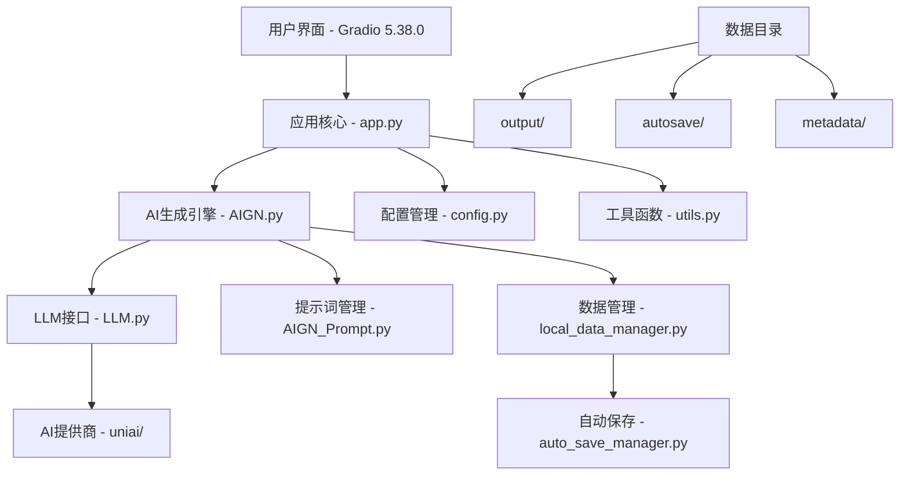

# 📚 AI网络小说生成器 - 系统文档

## 📋 项目信息

**项目名称**: AI网络小说生成器  
**版本**: v3.1.0  
**发布日期**: 2025-08-02  
**技术栈**: Python 3.10+ + Gradio 5.38.0  
**许可证**: MIT License  
**维护状态**: 🟢 积极维护  

## 🏗️ 系统架构

### 核心组件

```
AI_Gen_Novel/
├── 🎯 核心应用
│   ├── app.py                 # 主应用程序 (Gradio 5.38.0)
│   ├── AIGN.py               # AI生成核心引擎
│   ├── LLM.py                # 大语言模型接口
│   └── AIGN_Prompt.py        # 提示词管理
│
├── 🤖 AI提供商
│   └── uniai/                # 统一AI接口
│       ├── openrouterAI.py   # OpenRouter
│       ├── claudeAI.py       # Claude (Anthropic)
│       ├── geminiAI.py       # Gemini (Google)
│       ├── deepseekAI.py     # DeepSeek
│       ├── lmstudioAI.py     # LM Studio
│       ├── zhipuAI.py        # 智谱AI (GLM)
│       ├── aliAI.py         # 阿里云通义千问
│       ├── fireworksAI.py    # Fireworks AI
│       ├── grokAI.py         # Grok (xAI)
│       └── lambdaAI.py       # Lambda Labs
│
├── 🛠️ 工具模块
│   ├── utils.py              # 工具函数
│   ├── local_data_manager.py # 本地数据管理
│   ├── auto_save_manager.py  # 自动保存管理
│   └── json_auto_repair.py   # JSON自动修复
│
├── ⚙️ 配置管理
│   ├── config_template.py    # 配置模板 (安全)
│   ├── config.py            # 实际配置 (本地)
│   └── version.py           # 版本信息
│
├── 📁 数据目录
│   ├── output/              # 生成的小说文件
│   ├── autosave/           # 自动保存数据
│   └── metadata/           # 元数据文件
│
└── 🔧 环境和脚本
    ├── gradio5_env/        # Python虚拟环境
    ├── start.bat           # Windows启动脚本
    ├── requirements_gradio5.txt # 依赖文件
    └── .gitignore          # Git忽略规则
```

### 技术架构



## 🔧 核心功能模块

### 1. AI生成引擎 (AIGN.py)

**功能**: 小说生成的核心逻辑
- `genNovelOutline()`: 生成小说大纲
- `genDetailedOutline()`: 生成详细大纲
- `genBeginning()`: 生成小说开头
- `genNextParagraph()`: 生成下一段落
- `genStoryline()`: 生成故事线
- `autoGenerate()`: 自动生成功能

### 2. 用户界面 (app.py)

**技术**: Gradio 5.38.0
**特性**:
- 实时状态显示
- 分阶段进度跟踪
- 用户确认机制
- 智能错误处理
- 类型安全绑定

### 3. AI提供商接口 (uniai/)

**支持的提供商**:
- OpenRouter (多模型聚合)
- Claude (Anthropic)
- Gemini (Google)
- DeepSeek (高性价比)
- LM Studio (本地部署)
- 智谱AI (GLM模型)
- 阿里云通义千问
- Fireworks AI
- Grok (xAI)
- Lambda Labs

### 4. 数据管理系统

**本地数据管理** (`local_data_manager.py`):
- 自动保存用户数据
- 智能数据加载
- 数据导入导出

**自动保存** (`auto_save_manager.py`):
- 定时自动保存
- 增量保存优化
- 数据完整性检查

## 🔒 安全设计

### 敏感数据保护

1. **API密钥安全**:
   - 使用 `config_template.py` 作为安全模板
   - 实际配置 `config.py` 不上传到GitHub
   - 完善的 `.gitignore` 保护

2. **用户数据保护**:
   - `output/` 目录: 用户生成的小说
   - `autosave/` 目录: 自动保存数据
   - `metadata/` 目录: 元数据文件
   - 所有用户数据严格本地保存

3. **GitHub上传安全**:
   - 详细的上传指南
   - 自动安全检查脚本
   - 敏感文件自动忽略

### 数据流安全

```
用户输入 → 本地处理 → API调用 → 结果处理 → 本地保存
    ↓
所有敏感数据仅在本地处理，不会泄露到外部
```

## 🚀 性能优化

### 1. 内存优化
- 减少不必要的组件创建
- 智能数据缓存
- 及时释放临时对象

### 2. 网络优化
- API调用超时控制
- 重试机制
- 连接池管理

### 3. 用户体验优化
- 实时状态反馈
- 分阶段加载
- 错误友好提示

## 📊 监控和日志

### 状态监控
- 生成进度实时显示
- 错误状态自动捕获
- 性能指标统计

### 日志系统
- 详细的操作日志
- 错误日志记录
- 调试信息输出

## 🔄 版本管理

### 版本号规则
- **主版本号**: 重大架构变更
- **次版本号**: 新功能添加
- **修订号**: 错误修复

### 发布流程
1. 代码开发和测试
2. 版本号更新
3. 文档更新
4. 安全检查
5. GitHub发布

## 🛠️ 开发指南

### 环境要求
- Python 3.10+
- Gradio 5.38.0
- 4GB+ 内存
- 稳定网络连接

### 开发环境设置
```bash
# 1. 克隆项目
git clone https://github.com/cs2764/AI_Gen_Novel.git
cd AI_Gen_Novel

# 2. 创建虚拟环境
python -m venv gradio5_env
source gradio5_env/bin/activate  # Linux/Mac
# gradio5_env\Scripts\activate.bat  # Windows

# 3. 安装依赖
pip install -r requirements_gradio5.txt

# 4. 配置API密钥
cp config_template.py config.py
# 编辑 config.py

# 5. 启动开发服务器
python app.py
```

### 代码规范
- 遵循PEP 8编码规范
- 使用类型注解
- 完善的错误处理
- 详细的注释文档

## 📈 未来规划

### v3.1.0 新增功能 (2025-08-02)
- ✨ **API超时扩展**: 所有AI提供商超时时间从10分钟扩展到20分钟
- 🎯 **自动刷新优化**: 自动生成页面默认开启自动刷新功能
- 🎨 **按钮状态管理**: 生成按钮和停止按钮智能状态切换
- 🔧 **配置系统优化**: 完善动态配置管理和状态同步
- 📚 **文档完善**: 更新CLAUDE.md和系统文档

### 短期目标 (v3.1.x)
- 性能优化和稳定性提升
- 新AI提供商支持
- 用户体验进一步改进
- 错误处理和恢复机制增强

### 中期目标 (v3.2.x)
- 多语言支持
- 高级创作功能
- 协作功能
- 云端同步

### 长期目标 (v4.0.x)
- 全新架构设计
- 微服务化
- 移动端支持
- 企业级功能

## 📞 技术支持

### 问题反馈
- **GitHub Issues**: 技术问题和功能建议
- **文档**: 详细的使用指南和FAQ
- **社区**: 用户交流和经验分享

### 贡献指南
- 欢迎提交Pull Request
- 遵循代码规范
- 完善的测试覆盖
- 详细的提交说明

---

**文档版本**: v3.0.0  
**最后更新**: 2025-01-24  
**维护者**: Claude Code  
**联系方式**: GitHub Issues
