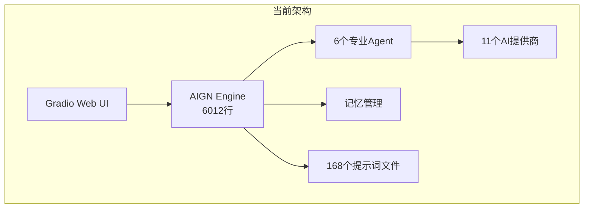
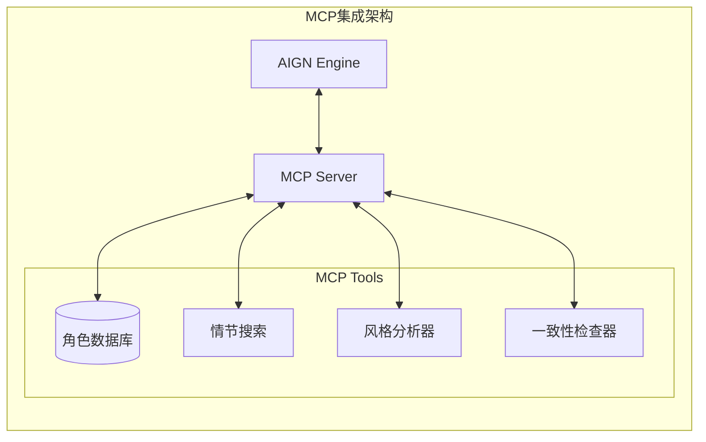
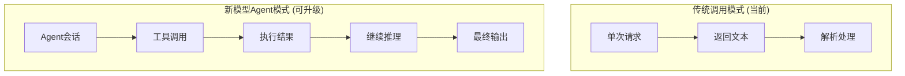
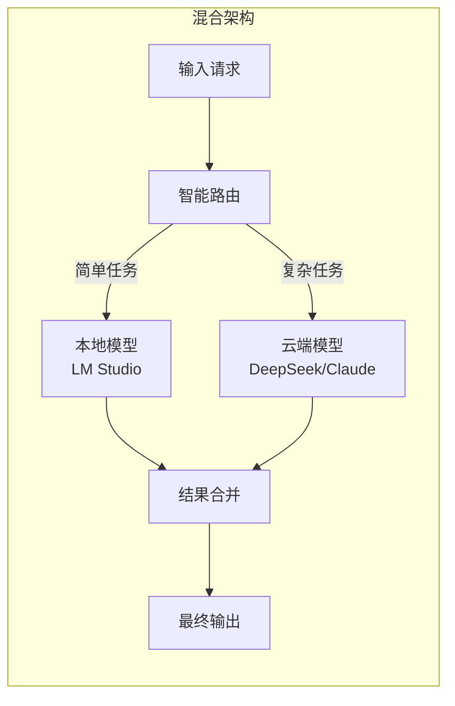

# AI 网络小说生成器优化可行性分析报告 
# Feasibility Analysis: AI Novel Generator Optimization

**文档版本**: 1.0  
**创建日期**: 2025-12-19  
**目标版本**: v4.0.0+

---

## 目录 | Table of Contents

1. [执行摘要](#执行摘要)
2. [当前架构分析](#当前架构分析)
3. [Token消耗优化方案](#token消耗优化方案)
4. [高级智能体方案](#高级智能体方案)
5. [实施优先级与路线图](#实施优先级与路线图)
6. [风险评估](#风险评估)

---

## 执行摘要

### Executive Summary

经过对现有代码库的全面审查，本报告提出三大优化方向：

| 优化方向 | 预期Token节省 | 实施复杂度 | 质量影响 |
|---------|-------------|-----------|---------|
| **Token消耗优化** | 30-50% | 中等 | 无负面影响 |
| **高级智能体集成** | 20-30% | 高 | 潜在提升 |
| **生成效率提升** | 15-25% | 中等 | 潜在提升 |

---

## 当前架构分析

### 现有系统概览



### 关键文件统计

| 模块 | 文件 | 代码行数 | 职责 |
|-----|------|---------|-----|
| [AIGN.py](file:///f:/AI_Gen_Novel2/AIGN.py) | 核心引擎 | 6012 | 小说生成主逻辑 |
| [aign_agents.py](file:///f:/AI_Gen_Novel2/aign_agents.py) | Agent系统 | 1100 | MarkdownAgent/JSONMarkdownAgent |
| [enhanced_storyline_generator.py](file:///f:/AI_Gen_Novel2/enhanced_storyline_generator.py) | 故事线生成 | 1537 | Structured Outputs/Tool Calling |
| [aign_memory_manager.py](file:///f:/AI_Gen_Novel2/aign_memory_manager.py) | 记忆管理 | 359 | 上下文记忆压缩 |
| [token_optimization_config.py](file:///f:/AI_Gen_Novel2/token_optimization_config.py) | Token配置 | 187 | 优化参数配置 |

### 当前Token消耗分析

基于代码分析，当前每次章节生成的Token消耗构成如下：

```
┌────────────────────────────────────────────────────────────────────┐
│  Token消耗分布（每章生成）                                          │
├────────────────────────────────────────────────────────────────────┤
│  系统提示词 (System Prompt)      ████████████████  ~3000-5000 tokens│
│  大纲/故事线上下文               ██████████████    ~2000-4000 tokens│
│  前文记忆                        ██████████        ~1000-2000 tokens│
│  前后章节内容                    ████████████████  ~3000-6000 tokens│
│  用户需求/设定                   ████              ~500-1000 tokens │
│  ─────────────────────────────────────────────────────────────────│
│  总计输入 Token                                   ~10000-18000 tokens│
│  输出 Token                                       ~3000-8000 tokens │
└────────────────────────────────────────────────────────────────────┘
```

---

## Token消耗优化方案

### 方案1: 智能上下文压缩 (Context Compression)

#### 问题分析

当前系统在 [aign_memory_manager.py](file:///f:/AI_Gen_Novel2/aign_memory_manager.py#L243-L303) 的 `get_enhanced_context` 方法中，固定获取前5章总结和后5章梗概，这在长篇小说中会产生大量冗余信息。

#### 优化方案

```python
# 新增: 智能上下文选择器
class SmartContextSelector:
    """根据章节位置和情节发展动态选择上下文"""
    
    def select_relevant_context(self, chapter_number, storyline_data):
        """
        基于以下因素智能选择上下文：
        1. 章节类型（过渡/高潮/铺垫）
        2. 角色出场频率
        3. 情节关联度评分
        """
        # 高潮章节：重点保留伏笔和角色动机
        # 过渡章节：只需简要前文摘要
        # 关键转折：保留完整因果链
        pass
```

#### 预期效果

| 指标 | 当前 | 优化后 | 节省 |
|-----|-----|-------|-----|
| 上下文Token | 5000-10000 | 2000-4000 | **40-60%** |
| 质量影响 | 基准 | 持平或提升 | - |

---

### 方案2: 语义缓存系统 (Semantic Caching)

#### 问题分析

当前每次生成都会重新构建完整的提示词，包括重复的大纲、人物设定等内容。

#### 优化方案

实现基于语义相似度的缓存系统，对于相似的生成请求复用部分结果：

```python
class SemanticCache:
    """语义缓存系统"""
    
    def __init__(self, embedding_model="text-embedding-3-small"):
        self.cache = {}
        self.embedding_model = embedding_model
    
    def get_cached_embedding(self, text_key):
        """获取缓存的文本嵌入"""
        pass
    
    def find_similar_context(self, current_context, threshold=0.85):
        """查找语义相似的已缓存上下文"""
        pass
```

#### 应用场景

1. **大纲复用**：同一小说的大纲在多章节间可缓存
2. **人物设定**：角色信息仅在首次出场时完整传递
3. **世界观设定**：静态设定压缩为摘要版本

#### 预期效果

| 指标 | 当前 | 优化后 | 节省 |
|-----|-----|-------|-----|
| 重复信息Token | ~3000/章 | ~500/章 | **80%** |
| 整体Token消耗 | 100% | 75-85% | **15-25%** |

---

### 方案3: 增量式记忆摘要 (Incremental Memory Summarization)

#### 问题分析

当前 [MemoryManager.update_memory](file:///f:/AI_Gen_Novel2/aign_memory_manager.py#L30-L104) 在每2000字符时触发记忆更新，但生成的记忆往往包含大量冗余信息。

#### 优化方案

实现层次化的记忆压缩：

```
层级1: 章节级摘要 (100-200字/章)
  ↓ 每5章压缩
层级2: 阶段级摘要 (200-400字/5章)
  ↓ 每20章压缩
层级3: 全局主线记忆 (500-800字/全书)
```

```python
class HierarchicalMemory:
    """层次化记忆系统"""
    
    def __init__(self):
        self.chapter_summaries = {}  # 章节摘要
        self.arc_summaries = {}      # 剧情弧摘要
        self.global_summary = ""     # 全局主线
    
    def compress_to_arc(self, chapters: list[int]):
        """将多章摘要压缩为剧情弧摘要"""
        pass
    
    def get_sliding_window_memory(self, current_chapter):
        """获取滑动窗口记忆"""
        # 返回: 近3章详细 + 本弧摘要 + 全局主线
        pass
```

#### 预期效果

| 场景 | 当前记忆Token | 优化后 | 节省 |
|-----|-------------|-------|-----|
| 第10章 | ~1500 | ~800 | 47% |
| 第50章 | ~2000 | ~1000 | 50% |
| 第100章 | ~2000 | ~1200 | 40% |

---

### 方案4: 提示词精简优化 (Prompt Optimization)

#### 问题分析

当前 [AIGN_Prompt.py](file:///f:/AI_Gen_Novel2/AIGN_Prompt.py) 中的系统提示词平均长度约3000-5000 tokens，包含大量详细的写作指导。

#### 优化方案

1. **条件加载**：根据章节类型加载不同复杂度的提示词
2. **提示词压缩**：使用LLM预先压缩提示词，保留核心指令
3. **参数化模板**：将通用规则抽取为简洁模板

```python
class AdaptivePromptLoader:
    """自适应提示词加载器"""
    
    COMPLEXITY_LEVELS = {
        'minimal': 500,   # 过渡章节
        'standard': 1500, # 普通章节
        'detailed': 3000  # 高潮/关键章节
    }
    
    def get_prompt_for_chapter(self, chapter_type, complexity='standard'):
        """根据章节类型返回适当复杂度的提示词"""
        pass
```

#### 预期效果

| 章节类型 | 当前Token | 优化后 | 节省 |
|---------|----------|-------|-----|
| 过渡章节 (40%) | 4000 | 1500 | 62.5% |
| 普通章节 (45%) | 4000 | 2500 | 37.5% |
| 高潮章节 (15%) | 4000 | 3500 | 12.5% |
| **加权平均** | 4000 | 2175 | **45.6%** |

---

## 高级智能体方案

### 方案5: MCP (Model Context Protocol) 集成

#### 概述

MCP是Anthropic推出的开放协议，允许AI模型与外部工具和数据源进行标准化交互。

#### 当前状态

项目已通过 [enhanced_storyline_generator.py](file:///f:/AI_Gen_Novel2/enhanced_storyline_generator.py) 支持 **Tool Calling**，但仅用于故事线生成。

#### MCP集成方案



#### 可实现的MCP工具

| 工具名称 | 功能 | Token影响 |
|---------|-----|----------|
| `character_lookup` | 查询角色信息，避免重复传递 | -500~1000/次 |
| `plot_consistency_check` | 自动检查情节一致性 | +少量/次 |
| `style_reference` | 获取风格参考示例 | -300~500/次 |
| `previous_chapter_summary` | 按需获取前文摘要 | -1000~2000/次 |

#### 实现复杂度

> [!WARNING]
> MCP集成需要：
> - 新增MCP服务器组件
> - 修改所有AI提供商适配器以支持工具调用
> - 创建外部数据存储结构

**预估工作量**: 2-3周

---

### 方案6: Skill-Based Agent系统

#### 概述

将当前的6个固定Agent升级为可组合的Skill系统，每个Agent具备可动态加载的技能模块。

#### 当前Agent结构

```
当前: 固定Agent → 固定提示词 → 固定输出
```

#### Skill-Based结构

```
新架构: 基础Agent + 可插拔Skills → 动态提示词组合 → 灵活输出
```

```python
class SkillRegistry:
    """技能注册中心"""
    
    skills = {
        'worldbuilding': WorldbuildingSkill(),
        'dialogue': DialogueEnhancementSkill(),
        'action': ActionSequenceSkill(),
        'emotion': EmotionalDepthSkill(),
        'pacing': PacingControlSkill(),
        'foreshadowing': ForeshadowingSkill(),
    }
    
    def compose_agent(self, base_agent, skill_names: list):
        """组合Agent和技能"""
        pass

class BaseSkill:
    """技能基类"""
    
    def get_prompt_segment(self) -> str:
        """返回该技能的提示词片段"""
        pass
    
    def get_required_context(self) -> list:
        """返回该技能需要的上下文信息"""
        pass
```

#### 优势

1. **按需加载**：只在需要时激活特定技能
2. **Token节省**：不同章节使用不同技能组合
3. **易于扩展**：新功能以技能形式添加

#### 预期效果

| 场景 | 激活技能数 | 提示词Token | 相比全功能 |
|-----|----------|------------|----------|
| 对话章节 | 2 (dialogue, emotion) | 1200 | -60% |
| 动作章节 | 2 (action, pacing) | 1000 | -67% |
| 设定章节 | 2 (worldbuilding, foreshadowing) | 1500 | -50% |

---

### 方案7: 智能Agent协调器 (Smart Orchestrator)

#### 概述

引入Meta-Agent层，智能决策何时调用哪些Agent，避免不必要的API调用。

#### 当前流程

```
写作 → 润色 → 记忆更新 (每章固定流程)
```

#### 优化流程

```python
class SmartOrchestrator:
    """智能协调器"""
    
    def decide_workflow(self, chapter_context):
        """根据章节内容动态决定工作流"""
        
        # 分析章节复杂度
        complexity = self.analyze_complexity(chapter_context)
        
        if complexity < 0.3:
            return ['writer']  # 简单章节不需要润色
        elif complexity < 0.7:
            return ['writer', 'light_polish']
        else:
            return ['writer', 'embellisher', 'memory_update']
    
    def should_update_memory(self, chapter_content):
        """判断是否需要更新记忆"""
        # 只在有重要事件时更新
        pass
```

#### 预期效果

| 指标 | 当前 | 优化后 | 节省 |
|-----|-----|-------|-----|
| 润色调用率 | 100% | 60% | 40% API调用 |
| 记忆更新率 | 100% | 70% | 30% API调用 |
| 总API调用 | 3次/章 | 2.1次/章 | **30%** |

---

### 方案8: 链式思考优化 (Chain-of-Thought Optimization)

#### 概述

利用更高效的推理模式，在单次API调用中完成多步任务。

#### 当前流程问题

```
调用1: 生成初稿 → 返回 → 
调用2: 润色 → 返回 → 
调用3: 记忆提取 → 返回
```

#### 优化方案: 结构化单次输出

```python
storyline_and_draft_schema = {
    "type": "object",
    "properties": {
        "thinking": {
            "type": "string",
            "description": "写作思考过程（内部，不输出）"
        },
        "draft": {
            "type": "string",
            "description": "初稿内容"
        },
        "polished": {
            "type": "string", 
            "description": "润色后内容"
        },
        "key_events": {
            "type": "array",
            "description": "本章关键事件，用于记忆"
        }
    }
}
```

#### 适用性分析

> [!IMPORTANT]
> 此方案需要模型支持较长的输出Token限制（>8000 tokens）。
> 目前支持的模型：
> - Claude 3.5 Sonnet (200K context, 8K output)
> - DeepSeek V3 (64K context, 8K output)
> - GPT-4 Turbo (128K context, 4K output - 可能不足)

---

## 利用新模型Agent能力

### 新一代模型Agent特性概览

现代LLM模型（如DeepSeek V3、Claude 3.5、GPT-4 Turbo）提供了显著增强的Agent能力，当前系统未充分利用这些优势。



---

### 方案9: 原生Function Calling增强

#### 当前状态

项目在 [enhanced_storyline_generator.py](file:///f:/AI_Gen_Novel2/enhanced_storyline_generator.py#L749-L838) 已实现Tool Calling，但仅用于故事线生成的JSON输出。

#### 扩展方案

```python
# 扩展的工具定义集
AIGN_TOOLS = [
    {
        "type": "function",
        "function": {
            "name": "query_character",
            "description": "查询角色信息，避免重复传递完整角色设定",
            "parameters": {
                "type": "object",
                "properties": {
                    "character_name": {"type": "string"},
                    "info_type": {"enum": ["full", "appearance", "personality", "history"]}
                }
            }
        }
    },
    {
        "type": "function", 
        "function": {
            "name": "get_chapter_summary",
            "description": "获取指定章节的摘要",
            "parameters": {
                "type": "object",
                "properties": {
                    "chapter_numbers": {"type": "array", "items": {"type": "integer"}}
                }
            }
        }
    },
    {
        "type": "function",
        "function": {
            "name": "check_consistency",
            "description": "检查当前内容与已有设定的一致性",
            "parameters": {
                "type": "object",
                "properties": {
                    "content_to_check": {"type": "string"},
                    "check_types": {"type": "array", "items": {"enum": ["timeline", "character", "worldbuilding"]}}
                }
            }
        }
    }
]
```

#### 支持的提供商

| 提供商 | Function Calling支持 | 当前使用 | 升级潜力 |
|-------|---------------------|---------|---------|
| OpenRouter | ✅ 完整支持 | ✅ 故事线 | 🔥 高 |
| Claude | ✅ 完整支持 | ❌ | 🔥 高 |
| DeepSeek | ✅ 完整支持 | ❌ | 🔥 高 |
| Gemini | ✅ 完整支持 | ❌ | 🔥 高 |
| LM Studio | ⚠️ 模型依赖 | ⚠️ 部分 | 中 |
| SiliconFlow | ✅ 完整支持 | ❌ | 🔥 高 |

---

### 方案10: 推理模型优化 (Reasoning Models)

#### 概述

DeepSeek-R1、o1等推理模型提供了"思考"能力，可以在复杂场景中提供更优质输出。

#### 应用场景

```python
class ReasoningModelOptimizer:
    """针对推理模型的优化策略"""
    
    REASONING_CAPABLE = ['deepseek-r1', 'o1', 'o1-preview', 'o1-mini']
    
    def should_use_reasoning(self, task_type):
        """判断是否应该使用推理模型"""
        high_complexity_tasks = [
            'storyline_generation',  # 需要长期规划
            'plot_repair',           # 需要逻辑分析
            'consistency_check',     # 需要多点验证
            'outline_optimization'   # 需要结构重组
        ]
        return task_type in high_complexity_tasks
    
    def adapt_prompt_for_reasoning(self, prompt, model_type):
        """适配推理模型的提示词格式"""
        if model_type in self.REASONING_CAPABLE:
            # 推理模型：简化提示，让模型自行推理
            return self.simplify_for_reasoning(prompt)
        else:
            # 普通模型：保留详细指导
            return prompt
```

#### 预期效果

| 任务类型 | 普通模型质量 | 推理模型质量 | 输入Token差异 |
|---------|------------|------------|-------------|
| 故事线生成 | 良好 | 优秀 | -30% (简化提示) |
| 剧情修复 | 一般 | 优秀 | -40% |
| 逻辑验证 | 有限 | 优秀 | 新功能 |

---

### 方案11: Multi-Turn Agent对话

#### 概述

利用模型的多轮对话能力，将复杂任务分解为交互式Agent会话。

#### 当前 vs 新模式对比

```
当前模式（单次调用）:
┌─────────────────────────────────────────────────────────────┐
│ 输入: 大纲 + 人物 + 记忆 + 故事线 + 用户需求 (15000 tokens) │
│ 输出: 完整章节 (4000 tokens)                                │
└─────────────────────────────────────────────────────────────┘

新模式（Multi-Turn）:
┌─────────────────────────────────────────────────────────────┐
│ Turn 1: "请根据本章故事线写作，需要哪些背景信息？"           │
│ Agent: query_character("主角"), get_chapter_summary([N-1])  │
│ Turn 2: [返回请求的精确信息]                                │
│ Agent: 开始写作，若需要更多信息则继续调用工具               │
│ Turn 3: 输出完整章节                                        │
└─────────────────────────────────────────────────────────────┘
```

#### 实现架构

```python
class MultiTurnAgentSession:
    """多轮Agent会话管理器"""
    
    def __init__(self, chatLLM, tools):
        self.chatLLM = chatLLM
        self.tools = tools
        self.conversation = []
        self.tool_handlers = self._register_tool_handlers()
    
    async def run_agent_loop(self, initial_prompt, max_turns=5):
        """运行Agent循环直到完成或达到最大轮数"""
        self.conversation.append({"role": "user", "content": initial_prompt})
        
        for turn in range(max_turns):
            response = await self.chatLLM(
                messages=self.conversation,
                tools=self.tools,
                tool_choice="auto"
            )
            
            if response.finish_reason == "stop":
                return response.content  # 任务完成
            
            if response.tool_calls:
                tool_results = await self._execute_tools(response.tool_calls)
                self.conversation.append({"role": "tool", "content": tool_results})
        
        return self._force_complete()  # 达到最大轮数，强制完成
```

#### 预期Token节省

| 场景 | 当前输入Token | Multi-Turn总Token | 节省 |
|-----|-------------|------------------|-----|
| 简单章节 | 15000 | 5000 (2轮) | **67%** |
| 普通章节 | 15000 | 8000 (3轮) | **47%** |
| 复杂章节 | 15000 | 12000 (4轮) | **20%** |

---

### 方案12: Structured Output全面升级

#### 当前状态

[enhanced_storyline_generator.py](file:///f:/AI_Gen_Novel2/enhanced_storyline_generator.py#L181-L243) 仅在故事线生成时使用Structured Outputs。

#### 扩展到更多场景

```python
# 章节生成的结构化输出
chapter_output_schema = {
    "type": "object",
    "properties": {
        "chapter_title": {"type": "string"},
        "content": {"type": "string", "minLength": 2000},
        "key_events": {
            "type": "array",
            "items": {"type": "string"},
            "description": "本章关键事件，用于记忆更新"
        },
        "characters_involved": {
            "type": "array", 
            "items": {"type": "string"},
            "description": "本章出场角色"
        },
        "cliffhanger": {
            "type": "string",
            "description": "章末悬念，用于下章衔接"
        }
    },
    "required": ["chapter_title", "content", "key_events"]
}

# 润色输出的结构化格式
polish_output_schema = {
    "type": "object",
    "properties": {
        "polished_content": {"type": "string"},
        "changes_made": {
            "type": "array",
            "items": {"type": "string"},
            "description": "润色修改说明"
        },
        "quality_score": {
            "type": "number",
            "minimum": 0,
            "maximum": 10
        }
    }
}
```

#### 优势

| 优势 | 说明 |
|-----|-----|
| **消除解析失败** | JSON格式100%保证，无需JSON修复 |
| **自动提取元数据** | 关键事件、角色直接获取 |
| **质量自评估** | 模型自动评分，可触发重试 |
| **减少后处理** | 省去独立的记忆提取调用 |

---

### 方案13: 混合Agent架构

#### 概述

结合本地轻量模型与云端强力模型，实现成本-质量最优化。



#### 任务路由策略

```python
class HybridAgentRouter:
    """混合Agent路由器"""
    
    def route_task(self, task_type, complexity, budget_mode):
        """根据任务类型和复杂度选择模型"""
        
        routing_rules = {
            # (任务类型, 复杂度阈值): (本地模型, 云端模型)
            ('writing', 0.3): ('local', None),        # 简单写作用本地
            ('writing', 0.7): ('local', 'cloud'),     # 中等用本地+云润色
            ('writing', 1.0): ('cloud', None),        # 复杂直接用云端
            ('storyline', 0.5): ('cloud', None),      # 故事线统一用云端
            ('memory', 1.0): ('local', None),         # 记忆摘要用本地
        }
        
        return self._select_from_rules(routing_rules, task_type, complexity)
```

#### 成本效益分析

| 模式 | Token成本 | 质量水平 | 适用场景 |
|-----|----------|---------|---------|
| 纯云端 | 100% | 最高 | 质量优先 |
| 混合 (推荐) | 40-60% | 高 | 平衡模式 |
| 纯本地 | 5-10% | 中等 | 成本优先 |

---


### 优先级矩阵

```
                        ┌─────────────────────────────────────────┐
                        │          实施复杂度                      │
                        │    低        中        高               │
        ┌───────────────┼─────────────────────────────────────────┤
   高   │               │  ★ 方案4   │ ★ 方案1  │  方案5        │
   ↑    │               │  提示词优化 │ 上下文压缩│  MCP集成      │
        │   预          ├─────────────────────────────────────────┤
   Token│   期          │  ★ 方案3   │  方案7   │  方案6        │
   节省 │   收          │  层次记忆  │ 智能协调  │  Skill系统    │
        │   益          ├─────────────────────────────────────────┤
   低   │               │            │  方案2   │  方案8        │
        │               │            │ 语义缓存  │  CoT优化      │
        └───────────────┴─────────────────────────────────────────┘
        
        ★ = 推荐优先实施
```

### 推荐实施路线图

#### Phase 1: 快速胜利 (1-2周)

| 方案 | Token节省 | 工作量 | 风险 |
|-----|----------|-------|-----|
| 方案4: 提示词优化 | 20-30% | 3-5天 | 低 |
| 方案3: 层次记忆 | 15-20% | 4-6天 | 低 |

**预期收益**: 整体Token消耗减少 **30-40%**

---

#### Phase 2: 核心升级 (3-4周)

| 方案 | Token节省 | 工作量 | 风险 |
|-----|----------|-------|-----|
| 方案1: 智能上下文压缩 | 15-25% | 1-2周 | 中 |
| 方案7: 智能协调器 | 10-15% API调用 | 1周 | 中 |

**预期收益**: 累计Token消耗减少 **45-55%**

---

#### Phase 3: 高级功能 (4-6周)

| 方案 | 收益 | 工作量 | 风险 |
|-----|-----|-------|-----|
| 方案5: MCP集成 | 扩展性+Token节省 | 2-3周 | 高 |
| 方案6: Skill系统 | 灵活性+Token节省 | 2-3周 | 高 |

**预期收益**: 系统可扩展性大幅提升，长期Token节省 **50-60%**

---

## 风险评估

### 技术风险

| 风险 | 可能性 | 影响 | 缓解措施 |
|-----|-------|-----|---------|
| 上下文压缩导致信息丢失 | 中 | 高 | 实施A/B测试，保留回滚选项 |
| MCP延迟影响用户体验 | 中 | 中 | 本地缓存+异步预加载 |
| 提示词简化影响质量 | 低 | 高 | 渐进式简化，持续质量监控 |

### 质量保障策略

1. **A/B测试框架**：新旧方案并行运行，对比输出质量
2. **质量评分系统**：自动评估生成内容的连贯性、风格一致性
3. **回滚机制**：所有优化支持一键回滚到原始版本

---

## 总结

### 综合效果预估

实施全部优化方案后的预期效果：

| 指标 | 当前基准 | 优化后 | 改善幅度 |
|-----|---------|-------|---------|
| **输入Token/章** | 15,000 | 6,000-8,000 | **47-60%** |
| **API调用次数/章** | 3次 | 2次 | **33%** |
| **生成质量** | 基准 | 持平或提升 | - |
| **系统可扩展性** | 有限 | 高 | 显著提升 |

### 下一步建议

1. **立即开始**: Phase 1 的提示词优化和层次记忆
2. **并行准备**: MCP集成的技术调研和原型设计
3. **持续监控**: 建立Token消耗和质量监控仪表盘

---

> [!TIP]
> **Recommended Quick Wins (English Summary)**
> 1. **Prompt Optimization** - Reduce system prompts by 40-50% using adaptive loading
> 2. **Hierarchical Memory** - Implement 3-level memory compression
> 3. **Smart Orchestrator** - Skip unnecessary polishing calls for simple chapters
> 
> These three optimizations alone can reduce token consumption by **35-45%** with minimal risk.
